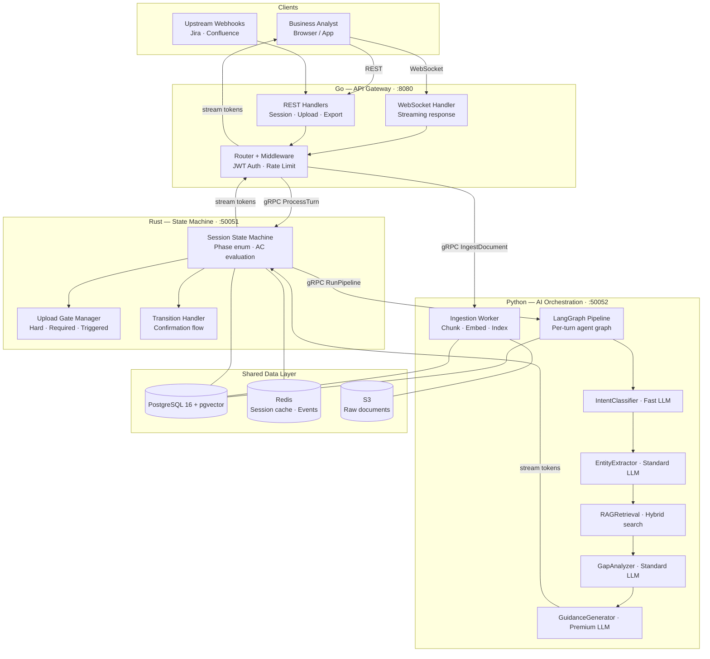
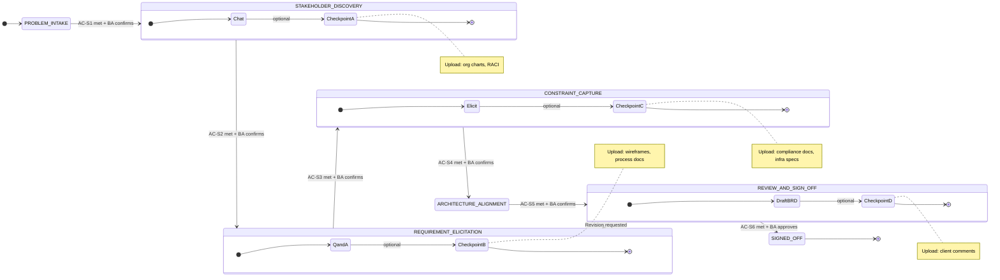
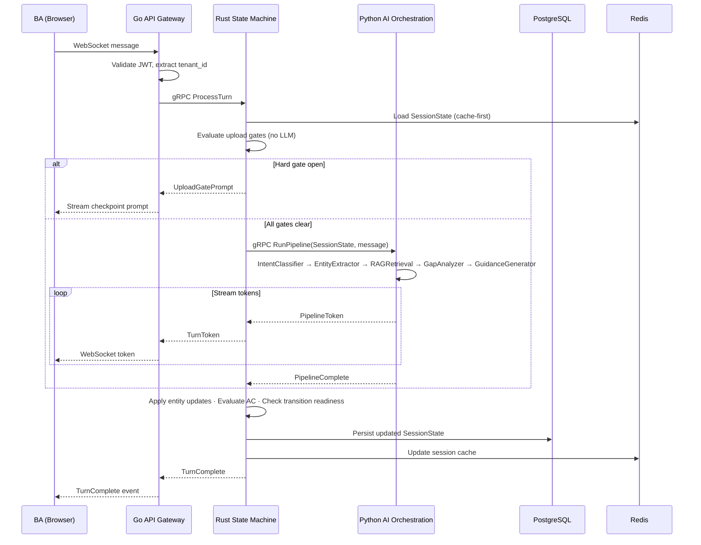

# Chitragupt

**Agentic Business Requirement Analyzer** — from raw stakeholder input to a signed-off BRD, in hours not weeks.


---

## What It Does

Chitragupt ingests multi-modal business inputs — PDFs, Jira epics, Confluence pages, audio recordings, architecture diagrams — and routes them through a retrieval-augmented generation pipeline to produce fully traceable, structured Business Requirements Documents. A Business Analyst drives the session through active conversation; the system never asks them to fill out a form.

Every requirement is grounded in a source chunk. Every inference is tagged with a confidence score. Every conflict between sources is escalated to a human. The BA leads, the system documents.

---

## Key Capabilities

| Capability | Detail |
|---|---|
| Multi-modal ingestion | PDF · DOCX · XLSX · Audio · Images · Video · URLs · Jira · Confluence · Notion · GitHub · Linear |
| BA-led HITL conversation | 7-phase protocol from problem intake to client sign-off — chat-first, not form-first |
| Grounded synthesis | Every requirement traces to source chunks; orphan knowledge is prohibited |
| Confidence scoring | Calibrated 0–1 score with mandatory tier tags: `[SYNTHESIZED]` `[INFERRED — VERIFY]` |
| Conflict resolution | Equal-tier source contradictions halt synthesis and escalate to human review |
| BRD generation | Templated DOCX/PDF with traceability matrix, domain glossary, and acceptance criteria |
| HLD generation | Mermaid · PNG · SVG high-level architecture diagrams signed off by the client |
| Multi-tenancy | RLS on every table; separate vector namespaces per tenant; zero cross-tenant data leakage |
| Budget control | Project and workspace-level LLM cost caps with hard circuit breakers |

---

## System Architecture

Chitragupt is a **three-service polyglot system**, each language chosen for its computational profile:

| Service | Language | Why |
|---|---|---|
| State Machine | **Rust** | Compile-time exhaustive state modeling, zero-GC, deterministic AC evaluation |
| AI Orchestration / RAG | **Python** | LLM/ML ecosystem is Python-first; LLM latency dominates all other costs |
| API Gateway | **Go** | High-throughput concurrent WebSocket connections; cheap goroutines; single binary |

Services communicate over **gRPC** with protobuf. They share PostgreSQL and Redis. No service touches another service's database directly.



---

## BA HITL Flow

The BA drives the entire session through structured conversation. The system leads — one question at a time — from problem statement to locked artifacts.



---

## Per-Turn Data Flow

On every BA message, the system evaluates state gates synchronously before calling any LLM:



---

## Current Status

**Sprint 1 — Core Engine in progress.**

| Component | Status |
|---|---|
| Rust state machine kernel | **Built** — `SessionPhase` enum, `SessionState`, AC evaluators, gate manager, `cargo build` ✓ |
| Proto definition (`state_engine.proto`) | **Built** — gRPC service interface defined |
| LangGraph pipeline (Python) | Todo — Sprint 1 P1 |
| Intent classifier | Todo — Sprint 1 P1 |
| Entity extractors | Todo — Sprint 1 P1 |
| RAG retrieval | Todo — Sprint 1 P1 |
| Document ingestion | Todo — Sprint 1 P2 |
| Go API gateway | Todo — Sprint 1 parallel track |
| BRD generator | Todo — Sprint 1 P3 / Sprint 2 |
| HLD generator | Todo — Sprint 1 P3 / Sprint 2 |

See [`docs/sprints/sprint1/README.md`](docs/sprints/sprint1/README.md) for the full priority ladder and epic breakdown.

---

## Repository Structure

```
chitragupt/
│
├── CLAUDE.md                       Claude Code instructions + prompt logging rule
├── CONTRIBUTING.md                 How to build, run, and contribute
├── LICENSE.md                      Proprietary — All Rights Reserved, Revorion AI
├── README.md                       This file
│
├── Cargo.toml                      Rust workspace manifest
├── Cargo.lock
├── rust-toolchain.toml             Pinned Rust toolchain version
│
├── services/
│   └── state-machine/              Rust — session state machine (:50051 gRPC)
│       ├── Cargo.toml
│       ├── proto/
│       │   └── state_engine.proto  gRPC service definition
│       └── src/
│           ├── main.rs
│           ├── state/              SessionPhase enum, SessionState, TransitionEngine
│           ├── ac/                 Acceptance criteria evaluators (s1.rs – s6.rs)
│           ├── gates/              Upload gate manager (Hard / Required / Triggered)
│           └── error.rs
│
├── docs/
│   ├── sprints/
│   │   ├── sprint0/                Discovery & documentation phase
│   │   │   ├── README.md           Sprint 0 overview and exit criteria
│   │   │   ├── BA_HITL_FLOW.md     7-phase BA conversation protocol
│   │   │   ├── ARCHITECTURE.md     Trust hierarchy, invariants, engineering conventions
│   │   │   └── DECISIONS.md        14 architectural decisions (tech stack, data layer, auth)
│   │   └── sprint1/
│   │       └── README.md           Core engine: state machine + RAG pipeline
│   ├── architecture/
│   │   ├── TECH_STACK.md           Service design, libraries, model versions (authoritative)
│   │   ├── ontology.md             Complete data model — entity schemas, relationships
│   │   ├── DATABASE.md             Schema, RLS, pgvector indexing, migration strategy
│   │   └── EPISTEMOLOGY.md         Knowledge acquisition rules — trust, confidence, conflict
│   ├── diagrams/                   Mermaid concept diagrams (state machine, trust, pipeline)
│   └── logs/
│       └── prompt_trail.md         Append-only prompt registry (P-001 → current)
│
    └── tech-docs/
        └── state-machine.md        Deep-dive: SessionPhase enum, AC system, gate types,
                                    TransitionEngine, gRPC interface, module structure
```

---

## Documentation Map

| Document | Audience | Purpose |
|---|---|---|
| [docs/tech-docs/state-machine.md](docs/tech-docs/state-machine.md) | Engineering | Complete technical reference for the Rust state machine kernel |
| [docs/architecture/TECH_STACK.md](docs/architecture/TECH_STACK.md) | Engineering · Architecture | Service design, library choices, model versions, gRPC interfaces |
| [docs/sprints/sprint0/BA_HITL_FLOW.md](docs/sprints/sprint0/BA_HITL_FLOW.md) | BA · PM | How BAs interact with the system phase by phase |
| [docs/sprints/sprint0/DECISIONS.md](docs/sprints/sprint0/DECISIONS.md) | Engineering · Architecture | 14 architectural decisions — options, tradeoffs, status |
| [docs/sprints/sprint0/ARCHITECTURE.md](docs/sprints/sprint0/ARCHITECTURE.md) | Engineering | Trust rules, invariants, coding and git conventions |
| [docs/sprints/sprint1/README.md](docs/sprints/sprint1/README.md) | Engineering | Sprint 1 priorities, epics, acceptance criteria, definition of done |
| [docs/architecture/ontology.md](docs/architecture/ontology.md) | Engineering · Architecture | Complete entity schemas, relationships, and JSON contracts |
| [docs/architecture/EPISTEMOLOGY.md](docs/architecture/EPISTEMOLOGY.md) | Engineering · AI/ML | Knowledge acquisition, confidence scoring, conflict protocol |
| [docs/architecture/DATABASE.md](docs/architecture/DATABASE.md) | Engineering · DBA | Schema, RLS, pgvector indexing, migration, data residency |
| [CONTRIBUTING.md](CONTRIBUTING.md) | Engineering | Build, run, contribute — per-service setup and conventions |

---

## Quick Start

```bash
# Infrastructure
docker compose up -d postgres redis

# Rust state machine
cargo build && cargo run

# Python AI orchestration (once ai-orchestration service is scaffolded)
cd services/ai-orchestration && uv sync && uv run python -m chitragupt.server

# Go API gateway (once api-gateway service is scaffolded)
cd services/api-gateway && go run ./cmd/server
```

See [CONTRIBUTING.md](CONTRIBUTING.md) for full setup instructions, environment variables, and development conventions.

---

## License

Proprietary — Copyright © 2026 Revorion AI. All Rights Reserved.
See [LICENSE.md](LICENSE.md) for full terms.

---

*Chitragupt · Revorion AI · May 2026*
