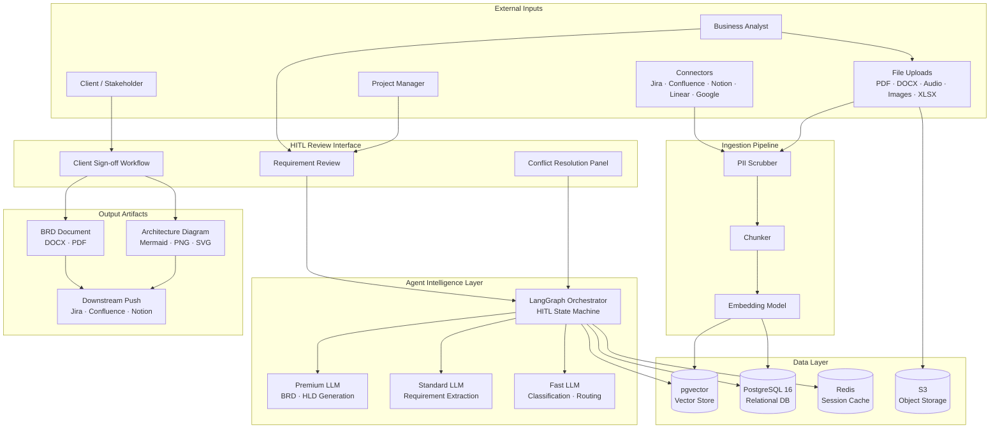
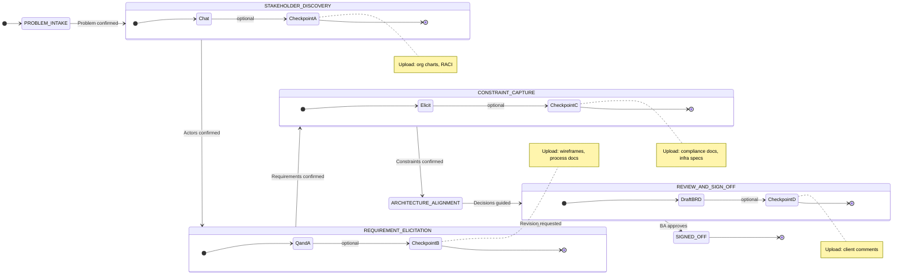
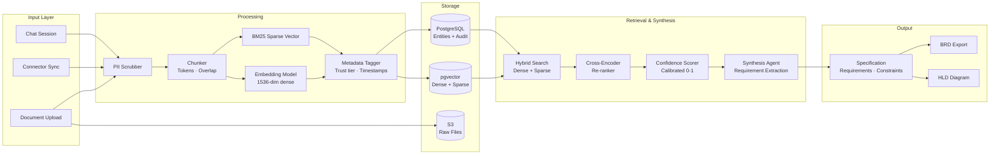

# Chitragupt

**Agentic Business Requirement Analyzer** — from raw stakeholder input to a signed-off BRD, in hours, not weeks.


---

## What It Does

Chitragupt ingests multi-modal business inputs — PDFs, Jira epics, Confluence pages, audio recordings, architecture diagrams — and routes them through a retrieval-augmented generation pipeline to produce fully traceable, structured Business Requirements Documents. A Business Analyst drives the session through active conversation; the system never asks them to fill out a form.

Every requirement is grounded in a source chunk. Every inference is tagged with a confidence score. Every conflict between sources is escalated to a human. The BA leads, the system documents.

---

## Key Capabilities

| Capability | Detail |
|---|---|
| Multi-modal ingestion | PDF · DOCX · XLSX · Audio · Images · Video · URLs · Jira · Confluence · Notion · GitHub · Linear |
| BA-led HITL conversation | 7-phase protocol from problem intake to client sign-off — chat-first, not form-first |
| Grounded synthesis | Every requirement traces to source chunks; orphan knowledge is prohibited |
| Confidence scoring | Calibrated 0–1 score with mandatory tier tags: `[SYNTHESIZED]` `[INFERRED — VERIFY]` |
| Conflict resolution | Equal-tier source contradictions halt synthesis and escalate to human review |
| BRD generation | Templated DOCX/PDF with traceability matrix, domain glossary, and acceptance criteria |
| HLD generation | Mermaid · PNG · SVG high-level architecture diagrams signed off by the client |
| Multi-tenancy | RLS on every table; separate vector namespaces per tenant; zero cross-tenant data leakage |
| Budget control | Project and workspace-level LLM cost caps with hard circuit breakers |

---

## System Architecture



---

## BA HITL Flow

The BA drives the entire session through structured conversation. The system leads — one question at a time — from problem statement to locked artifacts. Documents are uploaded only at designated checkpoints; nothing is required upfront.



---

## Data Pipeline



---

## Repository Structure

```
chitragupt/
│
├── CLAUDE.md                           Claude Code project instructions + prompt logging rule
├── README.md                           This file
│
├── docs/
│   ├── architecture/
│   │   ├── ontology.md                 Complete data model — entity schemas, relationships, JSON examples
│   │   ├── EPISTEMOLOGY.md             Knowledge acquisition rules — trust, confidence, conflict, temporal validity
│   │   └── DATABASE.md                 Schema design, RLS policies, vector indexing, migration strategy
│   └── logs/
│       └── prompt_trail.md             Prompt registry — every user prompt logged (P-001 → current)
│
└── sprint0/
    ├── README.md                        Sprint 0 overview, status, and exit criteria
    ├── BA_HITL_FLOW.md                  7-phase BA conversation protocol with checkpoint definitions
    ├── DECISIONS.md                     14 open architectural decisions — options, tradeoffs, status
    └── ARCHITECTURE.md                  Core principles: trust hierarchy, invariants, engineering conventions
```

---

## Documentation Map

| Document | Audience | Purpose |
|---|---|---|
| [sprint0/BA_HITL_FLOW.md](sprint0/BA_HITL_FLOW.md) | BA · PM | How BAs interact with the system phase by phase |
| [sprint0/DECISIONS.md](sprint0/DECISIONS.md) | Engineering · Architecture | All open tech decisions with options and tradeoffs |
| [sprint0/ARCHITECTURE.md](sprint0/ARCHITECTURE.md) | Engineering | Trust rules, invariants, coding and git conventions |
| [docs/architecture/ontology.md](docs/architecture/ontology.md) | Engineering · Architecture | Complete entity schemas, relationships, and JSON contracts |
| [docs/architecture/EPISTEMOLOGY.md](docs/architecture/EPISTEMOLOGY.md) | Engineering · AI/ML | Strict knowledge acquisition, confidence scoring, conflict protocol |
| [docs/architecture/DATABASE.md](docs/architecture/DATABASE.md) | Engineering · DBA | Schema, RLS, pgvector indexing, migration, residency |
| [docs/logs/prompt_trail.md](docs/logs/prompt_trail.md) | All | Chronological prompt registry — full project decision audit trail |

---

## Status

**Sprint 0 — Foundation.** No implementation code until all decisions in [`sprint0/DECISIONS.md`](sprint0/DECISIONS.md) reach `DECIDED` status.

Exit criteria:
- [ ] All 14 decisions in DECISIONS.md reach `GUIDED` or `DECIDED`
- [ ] BA_HITL_FLOW.md approved by BA team lead
- [ ] ARCHITECTURE.md ratified by engineering lead
- [ ] Ontology validated against BA flow outputs
- [ ] DATABASE.md schema reviewed and migration scripts drafted

---

*Chitragupt · Revorion AI · May 2026*
