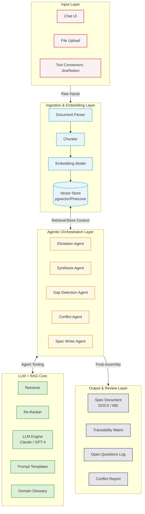

# RESEARCH DOCUMENT: Business Requirement Analyzer (BRA)

**Subtitle:** RAG-Based Agentic Requirements Processing System

## Document Info

| Details | Value |
| :--- | :--- |
| **Version** | 1.0 — Initial Research |
| **Date** | May 2026 |
| **Audience** | Product Team, Engineering Leads |
| **Status** | Draft — For Review |
| **Document Type** | Research & Scoping Brief |

---

## PURPOSE

This document provides foundational research to support the product team in defining the initial user story or epic for the **Business Requirement Analyzer (BRA)** — an AI-powered system that ingests multi-source client requirements, processes them through a RAG-based agentic pipeline, and produces structured specification documents.

## 1. Executive Summary

Modern enterprises face a persistent and costly challenge: translating diverse, ambiguous client requirements into actionable engineering specifications. Inputs arrive across emails, documents, meetings, ticketing systems, and conversational interfaces — each with different levels of structure, completeness, and clarity. The result is a requirements gap that delays delivery, increases rework, and erodes stakeholder trust.

The Business Requirement Analyzer (BRA) addresses this gap by building an AI-powered pipeline that ingests multi-source requirements, extracts and contextualizes intent through a Retrieval-Augmented Generation (RAG) based agentic workflow, and produces a structured, reviewable specifications document. This research document scopes the problem, defines the opportunity space, and presents a RAG-agentic use case to guide the product team's initial epic definition.

> [!IMPORTANT]
> **CORE VALUE PROPOSITION:** Reduce the time from raw client input to finalized specification from days or weeks to hours — with higher consistency, traceability, and completeness than manual processes.

---

## 2. Problem Statement

### 2.1 The Requirements Gap

The handoff between client intent and engineering execution is one of the most failure-prone stages in the software delivery lifecycle. According to industry research, between 40–60% of software defects trace back to poor or incomplete requirements — not to implementation errors. This is not a new problem, but it is one that has grown significantly more acute as:

- Development cycles have accelerated via agile and DevOps practices, compressing the time allocated for requirements elicitation.
- Client touchpoints have multiplied — requirements arrive through Slack threads, Confluence pages, Jira comments, meeting recordings, email chains, and uploaded documents simultaneously.
- Teams are increasingly cross-functional and distributed, making synchronous requirements clarification expensive and slow.
- AI-assisted development has raised expectations for specification quality, since code generation tools require precise, structured input to perform well.

### 2.2 Current State Pain Points

| Pain Point | Impact |
| :--- | :--- |
| **Requirements scattered across tools and formats** | Business analysts spend 30–50% of their time consolidating, not analyzing. |
| **Inconsistent specification standards** | Engineering teams receive specs of varying quality, leading to clarification back-and-forth. |
| **Missing non-functional requirements** | Performance, security, and scalability concerns are routinely omitted from initial specs. |
| **No traceability from input to spec** | Stakeholders cannot verify that their intent was captured or audit decisions later. |
| **Manual synthesis is a bottleneck** | BA capacity limits how many projects can be processed in parallel. |
| **Ambiguity surfaces late in development** | Rework at development or QA stage is 10–100x more expensive than catching gaps at requirements stage. |

### 2.3 Opportunity

Large language models — when grounded with domain knowledge through RAG and orchestrated by agentic reasoning — are exceptionally well-suited to requirements processing. They can read, synthesize, and re-structure unstructured input; surface implicit assumptions; detect ambiguities; and generate consistent output in a defined format. The BRA system aims to operationalize this capability within a controlled, traceable enterprise workflow.

---

## 3. Project Scope

### 3.1 In Scope — Phase 1

The initial release of the BRA system will focus on the following capabilities:

#### Input Ingestion

- Chat-based conversational interface for real-time requirements elicitation.
- File uploads: PDF, DOCX, TXT, Markdown, and Excel-based requirements matrices.
- Input of images, videos and audio.
- Structured data import from project management tools (Jira, Linear, Notion — via connectors).
- Paste or drag-and-drop unstructured text blobs.

#### Processing & Analysis

- Chunking and embedding of ingested content into a vector knowledge base.
- Intent classification — feature request, constraint, assumption, stakeholder concern.
- Gap detection — identification of missing functional and non-functional requirements.
- Conflict detection — surfacing contradictory requirements across sources.
- Entity extraction — actors, systems, data objects, triggers, and outcomes.

#### Output Generation

- Structured specification document in Markdown and DOCX format.
- Requirement categorization: Functional, Non-Functional, Constraints, Assumptions, Open Questions.
- Acceptance criteria drafts for each identified feature or story, test cases and negative test cases.
- Traceability matrix linking each spec item to its source input.

### 3.2 Out of Scope — Phase 1

- Automated Jira/Linear ticket creation (Phase 2)
- Real-time meeting transcription and live ingestion (Phase 2)
- Estimation or effort sizing (Phase 3)
- UI/UX prototyping from requirements (future)
- Code generation from specifications (separate product area)

### 3.3 Target Users

| User Persona | Primary Use |
| :--- | :--- |
| **Business Analyst / Product Manager** | Primary operator — ingests client inputs and reviews output specs |
| **Solutions Architect** | Reviews generated specs for technical completeness |
| **Delivery Lead / Scrum Master** | Validates specs before sprint planning and epic creation |
| **Client / Stakeholder** | Contributes requirements via the chat interface; reviews spec output |
| **Engineering Lead** | Consumes final specification document; provides feedback on gaps |

---

## 4. RAG-Based Agentic Workflow

The core intelligence of the BRA system is a Retrieval-Augmented Generation (RAG) agentic pipeline. RAG extends a base language model by grounding its reasoning in a dynamic knowledge base — in this case, the ingested requirements corpus, organizational templates, domain glossaries, and historical specification patterns. The agentic component introduces multi-step reasoning, tool use, and iterative refinement so the system can do more than simple retrieval or summarization.

### 4.1 Why RAG for Requirements?

> [!NOTE]
> **THE CORE CHALLENGE:** Requirements documents are inherently multi-document, multi-stakeholder, and domain-specific. A base LLM without retrieval cannot reliably reason across 20 uploaded documents, apply an organization's specific definition of "done," or surface conflicts between a requirement stated in a Jira ticket and a constraint buried in an email thread from six months ago.

**RAG solves these problems by:**

1. Chunking all ingested source documents and embedding them into a vector store at ingest time.
2. At query/generation time, retrieving the most semantically relevant chunks to the current reasoning step.
3. Grounding every generated claim in a retrieved source chunk, enabling full traceability back to the original input.
4. Allowing the knowledge base to grow incrementally — new documents can be added without retraining.

### 4.2 Agentic Orchestration Layer

The agentic layer sits above the RAG retrieval mechanism and governs the multi-step reasoning process. Rather than a single prompt-in / spec-out flow, the agent decomposes the specification task into a sequence of specialized sub-tasks, each of which may invoke retrieval, tool calls, or sub-agent delegation.

**Agent Roles in the Pipeline:**

| Agent / Component | Responsibility |
| :--- | :--- |
| **Ingestion Agent** | Accepts inputs across modalities, normalizes format, chunks content, generates embeddings, and writes to vector store |
| **Elicitation Agent** | Conducts chat-based requirements conversation, asks clarifying questions, and stores responses |
| **Retrieval & Synthesis Agent** | Retrieves relevant chunks, synthesizes a coherent draft, and flags low-confidence inferences |
| **Gap Detection Agent** | Cross-references emerging spec against a completeness checklist; raises open questions |
| **Conflict Resolution Agent** | Detects contradictions across retrieved chunks and surfaces them for human review |
| **Specification Writer Agent** | Assembles final document, applies organizational templates, and formats for output |
| **Review & Feedback Agent** | Accepts reviewer feedback, re-processes flagged sections, and versioning the output |

### 4.3 End-to-End Use Case Walkthrough

*SCENARIO: A fintech client wants to build a payment reconciliation feature. Inputs include: a 12-page PDF brief, a Confluence page with legacy system constraints, 3 Jira epics, and a live chat session.*

#### Step 1 — Ingestion

- The BA uploads the PDF, pastes the Confluence URL, links Jira epics, and opens a chat session.
- The **Ingestion Agent** processes each source: chunks text, generates embeddings, and stores vectors with metadata.
- A content summary is surfaced to the BA confirming what was ingested.

#### Step 2 — Conversational Elicitation

- The **Elicitation Agent** reviews ingested data and identifies coverage gaps (e.g., no SLA requirements found).
- It opens a structured dialogue in the chat: *"I noticed the brief doesn't specify expected transaction volumes. Can you give me a rough daily transaction count and a peak load scenario?"*
- The client's responses are embedded and added to the vector store in real time.

#### Step 3 — Retrieval-Augmented Synthesis

- The **Retrieval & Synthesis Agent** drafts sections. For Functional Requirements, it queries the vector store for "payment reconciliation behaviors".
- Retrieved chunks are synthesized into requirement statements with attached citations.
- Low-confidence inferences are flagged with `[INFERRED — VERIFY]`.

#### Step 4 — Gap & Conflict Detection

- The **Gap Detection Agent** runs the emerging spec against a completeness framework (e.g., missing security requirements like PCI-DSS).
- The **Conflict Resolution Agent** finds that the PDF states "reconciliation must run nightly" while a Jira epic states "real-time reconciliation is required." It surfaces this as a Conflict Item.

#### Step 5 — Specification Document Generation

- The **Specification Writer Agent** assembles the final document using the organization's template.
- Each requirement is tagged with a unique ID (FR-001, NFR-003), priority, source citations, and draft acceptance criteria.
- The document is rendered and delivered to the BA for review.

#### Step 6 — Review Loop

- The BA reviews the draft and leaves inline comments (e.g., "NFR-002 is too vague").
- The **Review & Feedback Agent** re-retrieves chunks and refines the flagged requirements.
- Approved document is locked and exported.

---

## 5. High-Level Architecture Overview

The diagram below outlines the logical component architecture of the BRA system.

---

## 6. Key Technical Considerations

| Consideration | Research Finding / Recommendation |
| :--- | :--- |
| **Chunking Strategy** | Semantic chunking (split on meaning, not fixed token count) outperforms fixed-window chunking. Target 300–600 tokens per chunk with 10–15% overlap. |
| **Embedding Model** | Domain-specific fine-tuning on requirements corpora improves retrieval precision by 15–30%. Evaluate `text-embedding-3-large` (OpenAI) and `voyage-large-2` (Anthropic). |
| **Re-ranking** | Two-stage retrieval (vector search → cross-encoder re-ranking) is essential to reduce hallucination risk. Cohere Rerank recommended. |
| **Agentic Framework** | LangGraph or a custom state-machine orchestrator preferred over sequential chains. Requirements processing is non-linear. |
| **Traceability** | Every generated requirement must carry a provenance record: source ID, chunk ID, retrieval score. Table-stakes feature. |
| **Hallucination Mitigation** | Generated specs with confidence below a threshold must be tagged as `[INFERRED]`. Human review is mandatory. |
| **Data Privacy** | Vector store must be tenant-isolated. Consider on-premise deployment options for regulated industries. |
| **Human-in-the-Loop** | System must support async review workflows (annotate, reject, approve), triggering targeted re-generation. |

---

## 7. Success Metrics & Acceptance Criteria

The following metrics should be established as baseline KPIs before the first production release:

### Quality Metrics

- Specification completeness score ≥ 85% (measured against a checklist by domain experts).
- Stakeholder acceptance rate ≥ 80% — proportion of specs approved with minor or no revisions.
- False conflict rate ≤ 10% — surfaced conflicts that experts deem non-issues.
- Traceability coverage = 100% — every generated requirement links to at least one source chunk.

### Efficiency Metrics

- Time-to-first-draft ≤ 2 hours from input submission for a mid-complexity project (vs. 2–5 business days manually).
- BA effort per spec reduced by ≥ 60% vs. current baseline.
- Rework rate reduction ≥ 30% in downstream development (tracked via post-release defects).

### System Performance

- Ingestion latency ≤ 60 seconds for documents up to 100 pages.
- Spec generation latency ≤ 5 minutes end-to-end for typical projects.
- Retrieval precision@5 ≥ 0.75 on internal evaluation set.

---

## 8. Risks & Mitigations

| Risk | Mitigation Strategy |
| :--- | :--- |
| **LLM hallucinations produce incorrect requirements** | Mandatory confidence tagging; human review gate before spec approval; retrieval-grounded generation only. |
| **Retrieval misses relevant context in large corpora** | Two-stage retrieval + re-ranking; chunk overlap strategy; user-surfaced citations for spot-checking. |
| **Stakeholder resistance to AI-generated specs** | Position as BA augmentation, not replacement; retain full human review; provide clear audit trail. |
| **Confidential data exposure** | Tenant-isolated vector stores; data residency controls; on-premise deployment option. |
| **Over-engineering agentic complexity** | Start with 2–3 agents (Ingestion, Synthesis, Spec Writer); add others in Phase 2. |
| **Requirements creep in scope** | Strictly enforce Phase 1 boundaries; capture out-of-scope items in a product backlog. |

---

## 9. Recommended Next Steps for Product Team

Based on this research, the following sequence is recommended for the product team to initiate the BRA program:

1. **Define the Epic:** Use Section 3 (Scope) and Section 4 (RAG Use Case) to draft the foundational epic: *"As a BA, I want to submit multi-source client requirements so that the system produces a structured, traceable specification document with minimal manual effort."*
2. **Establish an Evaluation Dataset:** Collect 5–10 representative historical requirements packages (inputs + accepted spec outputs) as ground truth.
3. **Technology Spike:** Run a 2-week spike to validate the embedding + retrieval stack. Decide on embedding model, vector store, chunking strategy, and re-ranker.
4. **Define the Spec Template:** Standardize the output format (sections, taxonomy, ID schema) before building the Spec Writer Agent.
5. **Start Minimal:** Build Phase 1 pipeline with Ingestion + Synthesis + Spec Writer agents only.
6. **Establish the Human Review Gate:** Design the review workflow and UI before building the agentic loop.

---

## 10. Reference Areas for Further Research

- RAG survey literature: Lewis et al. (2020) "Retrieval-Augmented Generation for Knowledge-Intensive NLP Tasks"; Gao et al. (2023) "Retrieval-Augmented Generation for Large Language Models: A Survey"
- Agentic frameworks: LangGraph documentation; AutoGen (Microsoft Research); CrewAI multi-agent patterns
- Requirements engineering standards: IEEE 830 Software Requirements Specifications; IREB CPRE Foundation Level syllabus
- Vector database comparisons: pgvector, Pinecone, Weaviate, Qdrant — latency and recall benchmarks at 1M+ vector scale
- Chunking strategy research: "Evaluating Chunking Strategies for Retrieval" (Chroma, 2024)
- Enterprise AI trust and explainability: NIST AI Risk Management Framework (AI RMF 1.0) for human-in-the-loop design patterns

---

> End of Research Document • Business Requirement Analyzer • v1.0 • May 2026
