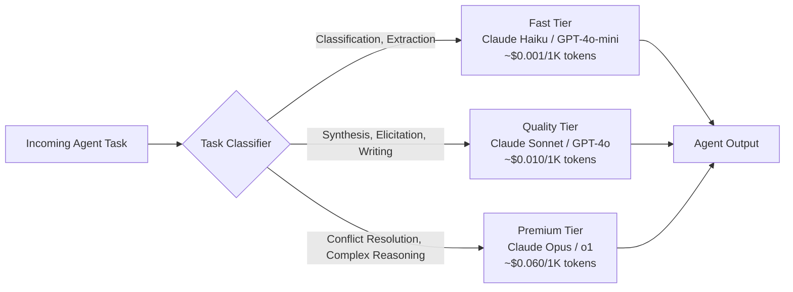

# RESEARCH DOCUMENT: Business Requirement Analyzer (BRA)

**Subtitle:** RAG-Based Agentic Requirements Processing System

## Document Info

| Details | Value |
| :--- | :--- |
| **Version** | 2.0 — Expanded Research |
| **Date** | May 2026 |
| **Audience** | Product Team, Engineering Leads, Solutions Architects |
| **Status** | Draft — For Review |
| **Document Type** | Research & Scoping Brief |

---

## PURPOSE

This document provides foundational research to support the product team in defining the initial user story or epic for the **Business Requirement Analyzer (BRA)** — an AI-powered system that ingests multi-source client requirements, processes them through a RAG-based agentic pipeline, and produces structured specification documents. This version expands the initial brief to comprehensively cover AI model selection, budget and cost architecture, performance design, UX philosophy, deployment options, and integration ecosystem.

## 1. Executive Summary

Modern enterprises face a persistent and costly challenge: translating diverse, ambiguous client requirements into actionable engineering specifications. Inputs arrive across emails, documents, meetings, ticketing systems, and conversational interfaces — each with different levels of structure, completeness, and clarity. The result is a requirements gap that delays delivery, increases rework, and erodes stakeholder trust.

The Business Requirement Analyzer (BRA) addresses this gap by building an AI-powered pipeline that ingests multi-source requirements, extracts and contextualizes intent through a Retrieval-Augmented Generation (RAG) based agentic workflow, and produces a structured, reviewable specifications document.

> [!IMPORTANT]
> **CORE VALUE PROPOSITION:** Reduce the time from raw client input to finalized specification from days or weeks to hours — with higher consistency, traceability, and completeness than manual processes.

**Key Design Pillars:**

| Pillar | Design Goal |
| :--- | :--- |
| **Accuracy** | Every requirement grounded in source evidence; no hallucinated claims |
| **Speed** | First draft within 2 hours of submission for mid-complexity projects |
| **Ease of Use** | A BA with no AI background can produce a specification on day one |
| **Cost Control** | Predictable per-project cost with tiered model selection to optimize spend |
| **Trust** | Full traceability, confidence scoring, and human override authority |
| **Security** | Tenant isolation, data residency controls, compliance-ready architecture |

---

## 2. Problem Statement

### 2.1 The Requirements Gap

The handoff between client intent and engineering execution is one of the most failure-prone stages in the software delivery lifecycle. According to industry research, between 40–60% of software defects trace back to poor or incomplete requirements — not to implementation errors. This is not a new problem, but it has grown significantly more acute as:

- Development cycles have accelerated via agile and DevOps practices, compressing the time allocated for requirements elicitation.
- Client touchpoints have multiplied — requirements arrive through Slack threads, Confluence pages, Jira comments, meeting recordings, email chains, and uploaded documents simultaneously.
- Teams are increasingly cross-functional and distributed, making synchronous requirements clarification expensive and slow.
- AI-assisted development has raised expectations for specification quality, since code generation tools require precise, structured input to perform well.

### 2.2 Current State Pain Points

| Pain Point | Impact |
| :--- | :--- |
| **Requirements scattered across tools and formats** | Business analysts spend 30–50% of their time consolidating, not analyzing. |
| **Inconsistent specification standards** | Engineering teams receive specs of varying quality, leading to clarification back-and-forth. |
| **Missing non-functional requirements** | Performance, security, and scalability concerns are routinely omitted from initial specs. |
| **No traceability from input to spec** | Stakeholders cannot verify that their intent was captured or audit decisions later. |
| **Manual synthesis is a bottleneck** | BA capacity limits how many projects can be processed in parallel. |
| **Ambiguity surfaces late in development** | Rework at development or QA stage is 10–100x more expensive than catching gaps at requirements stage. |

### 2.3 Opportunity

Large language models — when grounded with domain knowledge through RAG and orchestrated by agentic reasoning — are exceptionally well-suited to requirements processing. They can read, synthesize, and re-structure unstructured input; surface implicit assumptions; detect ambiguities; and generate consistent output in a defined format. The BRA system aims to operationalize this capability within a controlled, traceable enterprise workflow.

---

## 3. Project Scope

### 3.1 In Scope — Phase 1

#### Input Ingestion

- Chat-based conversational interface for real-time requirements elicitation.
- File uploads: PDF, DOCX, TXT, Markdown, and Excel-based requirements matrices.
- Input of images, voice recordings, and short video clips (transcribed to text via Whisper or equivalent).
- Structured data import from project management tools (Jira, Linear, Notion — via connectors).
- Paste or drag-and-drop unstructured text blobs.
- URL ingestion for publicly accessible web pages and Confluence pages.

#### Processing & Analysis

- Chunking and embedding of ingested content into a tenant-isolated vector knowledge base.
- Intent classification — feature request, constraint, assumption, stakeholder concern.
- Gap detection — identification of missing functional and non-functional requirements.
- Conflict detection — surfacing contradictory requirements across sources.
- Entity extraction — actors, systems, data objects, triggers, and outcomes.
- Confidence scoring and `[INFERRED]` flagging for synthesized claims.

#### Output Generation

- Structured specification document in Markdown and DOCX format.
- Requirement categorization: Functional, Non-Functional, Constraints, Assumptions, Open Questions.
- Acceptance criteria drafts for each identified feature or story, including positive and negative test cases.
- Traceability matrix linking each spec item to its source input chunk.
- Open Questions Log and Conflict Report as supplementary outputs.

### 3.2 Out of Scope — Phase 1

- Automated Jira/Linear ticket creation (Phase 2)
- Real-time meeting transcription and live ingestion (Phase 2)
- Estimation or effort sizing (Phase 3)
- UI/UX prototyping from requirements (future)
- Code generation from specifications (separate product area)
- Automated spec approval workflows with downstream deployment triggers (Phase 3)

### 3.3 Target Users

| User Persona | Primary Use | Expected Frequency |
| :--- | :--- | :--- |
| **Business Analyst / Product Manager** | Primary operator — ingests client inputs and reviews output specs | Daily |
| **Solutions Architect** | Reviews generated specs for technical completeness | Per project |
| **Delivery Lead / Scrum Master** | Validates specs before sprint planning and epic creation | Per sprint cycle |
| **Client / Stakeholder** | Contributes requirements via the chat interface; reviews spec output | Per engagement |
| **Engineering Lead** | Consumes final specification document; provides feedback on gaps | Per project |
| **Compliance Officer** | Reviews specs for regulatory completeness (GDPR, PCI-DSS, HIPAA) | On regulated projects |

---

## 4. RAG-Based Agentic Workflow

The core intelligence of the BRA system is a Retrieval-Augmented Generation (RAG) agentic pipeline. RAG extends a base language model by grounding its reasoning in a dynamic knowledge base — in this case, the ingested requirements corpus, organizational templates, domain glossaries, and historical specification patterns.

### 4.1 Why RAG for Requirements?

> [!NOTE]
> **THE CORE CHALLENGE:** Requirements documents are inherently multi-document, multi-stakeholder, and domain-specific. A base LLM without retrieval cannot reliably reason across 20 uploaded documents, apply an organization's specific definition of "done," or surface conflicts between a requirement stated in a Jira ticket and a constraint buried in an email thread from six months ago.

**RAG solves these problems by:**

1. Chunking all ingested source documents and embedding them into a vector store at ingest time.
2. At query/generation time, retrieving the most semantically relevant chunks to the current reasoning step.
3. Grounding every generated claim in a retrieved source chunk, enabling full traceability back to the original input.
4. Allowing the knowledge base to grow incrementally — new documents can be added without retraining.

### 4.2 RAG Pipeline Variants & Selection Rationale

| RAG Variant | Description | Recommended Use in BRA |
| :--- | :--- | :--- |
| **Naive RAG** | Embed → retrieve top-K → generate | Not sufficient — poor for multi-step reasoning |
| **Advanced RAG** | Adds pre-retrieval query rewriting and post-retrieval re-ranking | Baseline for all synthesis steps |
| **Modular RAG** | Pluggable retriever, re-ranker, generator modules | Target architecture — supports hot-swapping models |
| **Agentic RAG** | LLM decides what to retrieve, when, and how many times | Required for Gap Detection and Conflict Resolution agents |
| **Graph RAG** | Knowledge graph + vector store hybrid | Phase 2 — better for entity relationship traversal |

**Recommendation:** Start with Advanced RAG for Sprint 1–2, evolve to Agentic RAG by Sprint 3, plan Graph RAG for Phase 2 when the requirement entity graph matures.

### 4.3 Agentic Orchestration Layer

| Agent / Component | Responsibility | Model Tier |
| :--- | :--- | :--- |
| **Ingestion Agent** | Accepts inputs, normalizes format, chunks, embeds, writes to vector store | Fast (embedding model only) |
| **Elicitation Agent** | Conducts chat-based requirements conversation, asks clarifying questions | Quality (conversational LLM) |
| **Retrieval & Synthesis Agent** | Retrieves relevant chunks, synthesizes coherent draft, flags low-confidence inferences | Quality |
| **Gap Detection Agent** | Cross-references emerging spec against completeness checklist; raises open questions | Quality |
| **Conflict Resolution Agent** | Detects contradictions across retrieved chunks; surfaces for human review | Premium (complex reasoning) |
| **Specification Writer Agent** | Assembles final document, applies templates, formats for output | Quality |
| **Review & Feedback Agent** | Accepts reviewer feedback, re-processes flagged sections, versions output | Quality |
| **Classification Agent** | Classifies requirement type, priority, and affected actor | Fast (classification task) |

### 4.4 End-to-End Use Case Walkthrough

*SCENARIO: A fintech client wants to build a payment reconciliation feature. Inputs include: a 12-page PDF brief, a Confluence page with legacy system constraints, 3 Jira epics, and a live chat session.*

#### Step 1 — Ingestion

- The BA uploads the PDF, pastes the Confluence URL, links Jira epics, and opens a chat session.
- The **Ingestion Agent** processes each source: chunks text, generates embeddings using `voyage-large-2` or `text-embedding-3-large`, and stores vectors with metadata (source ID, page, timestamp, author).
- A content summary is surfaced to the BA confirming what was ingested with a document inventory table.

#### Step 2 — Conversational Elicitation

- The **Elicitation Agent** reviews ingested data and identifies coverage gaps (e.g., no SLA requirements found).
- It opens a structured dialogue: *"I noticed the brief doesn't specify expected transaction volumes. Can you give me a rough daily transaction count and a peak load scenario?"*
- The client's responses are embedded and added to the vector store in real time with `source_type: chat_elicitation`.

#### Step 3 — Retrieval-Augmented Synthesis

- The **Retrieval & Synthesis Agent** drafts sections. For Functional Requirements, it queries the vector store for "payment reconciliation behaviors" using hybrid search (dense + sparse).
- Retrieved chunks are synthesized into requirement statements with attached citations.
- Low-confidence inferences (confidence < 0.85) are flagged with `[INFERRED — VERIFY]`.

#### Step 4 — Gap & Conflict Detection

- The **Gap Detection Agent** runs the emerging spec against a completeness framework (e.g., missing security requirements like PCI-DSS). It raises Open Questions for each gap.
- The **Conflict Resolution Agent** finds that the PDF states "reconciliation must run nightly" while a Jira epic states "real-time reconciliation is required." It surfaces this as a Conflict Item with both source citations visible.

#### Step 5 — Specification Document Generation

- The **Specification Writer Agent** assembles the final document using the organization's template.
- Each requirement is tagged with a unique ID (FR-001, NFR-003), priority, source citations, and draft acceptance criteria.
- The document is streamed to the BA in real time as sections complete.

#### Step 6 — Review Loop

- The BA reviews the draft and leaves inline comments (e.g., "NFR-002 is too vague").
- The **Review & Feedback Agent** re-retrieves chunks and refines the flagged requirements.
- Human edits are written back to the system as ground truth overrides, versioning the specification.
- Approved document is locked and exported in the selected format.

---

## 5. High-Level Architecture Overview

```mermaid
flowchart TD
    classDef inputLayer fill:#f9f2f4,stroke:#d9534f,stroke-width:2px,color:#333
    classDef ingestLayer fill:#e8f4f8,stroke:#5bc0de,stroke-width:2px,color:#333
    classDef agentLayer fill:#fcf8e3,stroke:#f0ad4e,stroke-width:2px,color:#333
    classDef coreLayer fill:#dff0d8,stroke:#5cb85c,stroke-width:2px,color:#333
    classDef outputLayer fill:#e5e5ea,stroke:#6c757d,stroke-width:2px,color:#333
    classDef cacheLayer fill:#fce4ec,stroke:#e91e63,stroke-width:2px,color:#333

    subgraph Input ["Input Layer"]
        UI[Chat UI]:::inputLayer
        FU[File Upload<br/>PDF/DOCX/MD/XLS]:::inputLayer
        MM[Multimedia<br/>Audio/Image]:::inputLayer
        TC[Tool Connectors<br/>Jira / Notion / Confluence]:::inputLayer
    end

    subgraph Ingestion ["Ingestion & Embedding Layer"]
        PP[Pre-processor<br/>OCR / Transcription / Parser]:::ingestLayer
        CH[Semantic Chunker<br/>300-600 tokens]:::ingestLayer
        EM[Embedding Model<br/>voyage-large-2 / text-emb-3]:::ingestLayer
        VS[(Tenant-Isolated<br/>Vector Store)]:::ingestLayer
        MC[(Metadata Store<br/>PostgreSQL)]:::ingestLayer

        PP --> CH --> EM --> VS
        EM --> MC
    end

    subgraph Cache ["Caching Layer"]
        SC[Semantic Cache<br/>Similar query dedup]:::cacheLayer
        PC[Prompt Cache<br/>System prompt prefix]:::cacheLayer
    end

    subgraph Orchestration ["Agentic Orchestration Layer<br/>(LangGraph State Machine)"]
        IA[Ingestion Agent]:::agentLayer
        EA[Elicitation Agent]:::agentLayer
        SA[Synthesis Agent]:::agentLayer
        CL[Classification Agent]:::agentLayer
        GDA[Gap Detection Agent]:::agentLayer
        CA[Conflict Agent]:::agentLayer
        SWA[Spec Writer Agent]:::agentLayer
        RFA[Review & Feedback Agent]:::agentLayer
    end

    subgraph RAGCore ["LLM + RAG Core"]
        RT[Hybrid Retriever<br/>Dense + Sparse]:::coreLayer
        RR[Cross-Encoder Re-Ranker<br/>Cohere Rerank]:::coreLayer
        LLM[LLM Router<br/>Fast / Quality / Premium Tier]:::coreLayer
        PT[Prompt Templates<br/>Domain-Specific]:::coreLayer
        DG[Domain Glossary<br/>& Org Templates]:::coreLayer
    end

    subgraph Output ["Output & Review Layer"]
        SD[Spec Document<br/>DOCX / MD / JSON]:::outputLayer
        TM[Traceability Matrix]:::outputLayer
        OQL[Open Questions Log]:::outputLayer
        CR[Conflict Report]:::outputLayer
        VH[Version History<br/>& Audit Trail]:::outputLayer
    end

    Input -->|Raw Inputs| Ingestion
    VS <-->|Retrieve Context| Cache
    Cache <-->|Cached / Miss| Orchestration
    Orchestration <-->|Agent Tooling| RAGCore
    RAGCore <-->|Ranked Chunks| Orchestration
    Orchestration -->|Final Assembly| Output
```



### 5.1 Model Routing Architecture



---

## 6. Key Technical Considerations

| Consideration | Research Finding / Recommendation |
| :--- | :--- |
| **Chunking Strategy** | Semantic chunking (split on meaning, not fixed token count) outperforms fixed-window chunking. Target 300–600 tokens per chunk with 10–15% overlap. Use recursive character text splitter as fallback. |
| **Embedding Model** | Evaluate `text-embedding-3-large` (OpenAI, 3072 dims) and `voyage-large-2` (Anthropic). Domain-specific fine-tuning improves retrieval precision by 15–30% on requirements corpora. |
| **Hybrid Search** | Combine dense vector search with BM25 sparse retrieval. Hybrid outperforms either alone by 5–15% on recall for technical documents where exact terminology matters. |
| **Re-ranking** | Two-stage retrieval (vector search → cross-encoder re-ranking) is essential to reduce hallucination risk. Cohere Rerank v3 or ColBERT recommended. |
| **Agentic Framework** | LangGraph preferred over sequential chains. Requirements processing is non-linear — state machines handle branching, retries, and parallel agent execution cleanly. |
| **Traceability** | Every generated requirement must carry a provenance record: source ID, chunk ID, retrieval score, agent ID, timestamp. Table-stakes feature. |
| **Hallucination Mitigation** | Generated specs below 85% confidence must be tagged `[INFERRED]`. Consider constitutional AI patterns for the Spec Writer Agent to self-check outputs. |
| **Data Privacy** | Vector store must be tenant-isolated (separate index or namespace per org). Consider on-premise deployment options for regulated industries. |
| **Human-in-the-Loop** | System must support async review workflows (annotate, reject, approve), triggering targeted re-generation of only the flagged sections. |
| **Context Window Management** | For very large corpora, use map-reduce synthesis patterns — synthesize per-section summaries, then synthesize summaries — rather than stuffing 200K tokens into one prompt. |
| **Streaming** | Stream LLM responses to the UI to reduce perceived latency. Users tolerate 10+ minute generation times if they see progressive output. |
| **Prompt Caching** | Use Anthropic's prompt caching for system prompt prefixes across agents. Expected 60–80% cost reduction on repeated agent calls with stable system prompts. |

---

## 7. AI Model Selection & Evaluation Framework

### 7.1 Model Selection Principles

The BRA system uses multiple models, each optimized for a specific task. A single model-for-all approach is both more expensive and less accurate than tiered routing. The key dimensions for selection are:

- **Reasoning depth** — how complex is the inference task?
- **Context window** — how much text must be held in a single inference call?
- **Latency** — is this a synchronous user-facing call or a background task?
- **Cost** — what is the per-token cost relative to the task value?
- **Modality** — does the task require vision (diagrams, screenshots)?

### 7.2 LLM Comparison Matrix

| Model | Provider | Context Window | Strengths | Weaknesses | Estimated Cost (output/1K tokens) | Recommended BRA Use |
| :--- | :--- | :--- | :--- | :--- | :--- | :--- |
| **Claude Sonnet 4.6** | Anthropic | 200K | Exceptional instruction following, long-context reasoning, prompt caching | - | ~$0.015 | Synthesis Agent, Spec Writer, Elicitation |
| **Claude Opus 4.7** | Anthropic | 200K | Highest reasoning quality, nuanced conflict analysis | Higher cost | ~$0.075 | Conflict Resolution, complex inference |
| **Claude Haiku 4.5** | Anthropic | 200K | Very fast, low cost, good at classification | Less nuanced | ~$0.001 | Classification, extraction, intent tagging |
| **GPT-4o** | OpenAI | 128K | Strong tool use, vision capability | Context window smaller | ~$0.010 | Alternative synthesis, diagram analysis |
| **GPT-4o-mini** | OpenAI | 128K | Fast, cheap, reliable | Less capable on complex tasks | ~$0.001 | Fast-tier fallback |
| **Gemini 1.5 Pro** | Google | 2M | Massive context (entire codebases) | Latency higher on very large inputs | ~$0.007 | Very large document sets (>500 pages) |
| **Llama 3.1 70B** | Meta (self-hosted) | 128K | Open source, on-premise deployable, no data leaves org | Higher infra cost, slightly lower quality | Infrastructure cost only | On-premise / regulated deployments |
| **Llama 3.3 70B** | Meta (self-hosted) | 128K | Improved reasoning over 3.1 | Self-hosting required | Infrastructure cost only | On-premise regulated deployments |

### 7.3 Embedding Model Comparison

| Model | Provider | Dimensions | Strengths | Cost (per 1M tokens) | Recommended Use |
| :--- | :--- | :--- | :--- | :--- | :--- |
| **text-embedding-3-large** | OpenAI | 3072 | Strong semantic accuracy, widely benchmarked | $0.13 | Default SaaS embedding |
| **voyage-large-2** | Anthropic/Voyage | 1536 | Optimized for retrieval, strong on technical domains | $0.12 | Preferred for requirements docs |
| **voyage-large-2-instruct** | Voyage AI | 1536 | Instruction-tuned, asymmetric retrieval | $0.12 | Query vs. passage asymmetry |
| **BGE-M3** | BAAI (OSS) | 1024 | Multilingual, hybrid dense+sparse, open source | Free (self-hosted) | Multilingual or on-premise |
| **Nomic Embed v1.5** | Nomic (OSS) | 768 | Fast, open source, good for high-volume ingestion | Free (self-hosted) | High-volume batch ingestion |

### 7.4 Model Selection Decision Tree

```
Is this task time-sensitive (user is waiting for a synchronous response)?
├── YES → Is the task complex reasoning (conflict detection, ambiguity resolution)?
│          ├── YES → Premium Tier (Claude Opus / o1)
│          └── NO  → Quality Tier (Claude Sonnet / GPT-4o)
└── NO  → Is the task simple classification, tagging, or extraction?
           ├── YES → Fast Tier (Claude Haiku / GPT-4o-mini)
           └── NO  → Run as background job, Quality or Premium Tier
```

### 7.5 Fallback & Resilience Strategy

No single LLM provider should be a single point of failure. The model router must implement:

1. **Primary provider**: Anthropic Claude (Sonnet for quality, Haiku for fast).
2. **Secondary fallback**: OpenAI GPT-4o / GPT-4o-mini on API timeout or 5xx errors.
3. **Graceful degradation**: If both primary and secondary fail, queue the task for async retry; notify user of delay.
4. **Rate limit handling**: Exponential backoff with jitter; requests distribute across provider API keys.
5. **Cost circuit breaker**: If a single project exceeds a configured cost threshold, pause agent calls and alert the project owner.

### 7.6 Fine-Tuning vs. RAG Decision

For BRA Phase 1, RAG is the correct choice over fine-tuning because:

| Factor | RAG Wins | Fine-Tuning Wins |
| :--- | :--- | :--- |
| Knowledge base changes frequently (new docs per project) | ✅ | |
| Exact source attribution required | ✅ | |
| Domain is highly specialized with proprietary data | ✅ | |
| Task is stylistic / format-driven | | ✅ |
| Low latency is paramount and context size is small | | ✅ |

**Phase 2 consideration:** Fine-tune a smaller model (Llama 3.1 8B) on the organization's accepted specifications to internalize output format and domain vocabulary — reducing token usage and improving consistency without sacrificing RAG for factual grounding.

---

## 8. Budget, Cost Architecture & Pricing Model

### 8.1 Cost Drivers

The BRA system has five primary cost drivers that must be tracked and optimized:

| Cost Driver | Description | Optimization Lever |
| :--- | :--- | :--- |
| **LLM Inference (Input tokens)** | All tokens sent to the model: system prompt + retrieved chunks + user input | Prompt caching, chunk size optimization, context compression |
| **LLM Inference (Output tokens)** | All tokens generated by the model | Constrain output length where possible; stream and truncate |
| **Embedding generation** | Tokens embedded during document ingestion | Batch embed, cache embeddings for unchanged documents |
| **Vector store** | Storage and query cost for embeddings | Prune stale vectors; compress with quantization (PQ) |
| **Infrastructure** | API servers, databases, queues, CDN | Autoscaling; spot/preemptible instances for background jobs |

### 8.2 Per-Project Cost Estimate (Mid-Complexity, ~50 pages input)

| Operation | Volume | Unit Cost | Estimated Cost |
| :--- | :--- | :--- | :--- |
| Document ingestion & embedding | ~100K tokens | $0.13/1M | ~$0.013 |
| Elicitation agent (5 turns) | ~5K tokens output | $0.015/1K | ~$0.075 |
| Synthesis agent (3 runs × 10K output) | ~30K tokens | $0.015/1K | ~$0.45 |
| Gap detection agent | ~5K tokens output | $0.001/1K (Haiku) | ~$0.005 |
| Conflict resolution (if triggered) | ~8K tokens output | $0.075/1K (Opus) | ~$0.60 |
| Spec writer agent | ~15K tokens output | $0.015/1K | ~$0.225 |
| Review loop (2 iterations) | ~10K tokens output | $0.015/1K | ~$0.15 |
| Vector store (30 days) | ~5MB | $0.025/GB/month | ~$0.0001 |
| **Total (with conflict)** | | | **~$1.50** |
| **Total (without conflict)** | | | **~$0.90** |

> [!NOTE]
> Prompt caching is expected to reduce input token costs by 60–80% on repeated agent calls (system prompts + few-shot examples cached). Effective per-project cost after caching optimizations: **$0.30–$0.70** for mid-complexity projects.

### 8.3 Cost at Scale

| Monthly Projects | Estimated Monthly LLM Cost | Infra Cost | Total |
| :--- | :--- | :--- | :--- |
| 10 projects | ~$15 | ~$200 | ~$215 |
| 100 projects | ~$100 | ~$400 | ~$500 |
| 1,000 projects | ~$700 | ~$1,200 | ~$1,900 |
| 10,000 projects | ~$5,000 | ~$4,000 | ~$9,000 |

### 8.4 Cost Optimization Strategy

1. **Prompt Caching** — Cache system prompt prefixes for all agents. Expected savings: 60–80% on input token costs for repeated invocations.
2. **Tiered Model Routing** — Classification and extraction tasks run on Haiku (~15x cheaper than Sonnet); complex reasoning only triggers Opus.
3. **Batch Embedding** — Ingest all files together; batch API calls to embedding providers reduce per-token cost by ~50%.
4. **Semantic Caching** — If two projects submit nearly identical requirement documents, the semantic cache returns the previously generated spec draft rather than re-running the full pipeline.
5. **Vector Quantization** — Use product quantization (PQ) on stored embeddings to reduce vector storage by 4–8x with minimal recall loss.
6. **Document Deduplication** — Hash-based deduplication at ingestion time prevents re-embedding identical source documents across projects.
7. **Output Streaming + Early Stop** — Stream outputs and allow users to stop generation early if initial output is sufficient.

### 8.5 Product Pricing Model Recommendations

| Tier | Target Customer | Inclusions | Suggested Price |
| :--- | :--- | :--- | :--- |
| **Starter** | Freelancers, small teams | 10 projects/month, 3 users, standard templates | $49/month |
| **Professional** | Agencies, mid-size teams | 50 projects/month, 15 users, custom templates, API access | $199/month |
| **Business** | Enterprise BAs, large organizations | 250 projects/month, unlimited users, priority support, SLA | $799/month |
| **Enterprise** | Regulated industries, on-prem | Custom volume, dedicated infra, compliance reporting, SSO | Custom |

**Cost-basis at Professional tier:** ~$100/month LLM + ~$50/month infra = $150 cost at 50 projects. $199 price = ~25% margin before support. Margin improves substantially with caching optimizations.

---

## 9. Speed, Latency & Performance Architecture

### 9.1 Latency Budget

Every user-facing interaction in the BRA system must fit within an SLA. The following budget governs design decisions:

| Operation | Synchronous SLA | Async Target |
| :--- | :--- | :--- |
| Chat message response (elicitation) | < 3 seconds to first token (streaming) | N/A |
| Small document ingestion (< 10 pages) | < 15 seconds | N/A |
| Large document ingestion (10–200 pages) | Show progress bar; background | < 3 minutes |
| Synthesis agent draft (per section) | < 30 seconds streaming | N/A |
| Full spec generation (mid-complexity) | < 5 minutes (streamed progressively) | N/A |
| Full spec generation (large, > 100 pages input) | Background job | < 20 minutes |
| Re-generation of a single flagged requirement | < 15 seconds | N/A |

### 9.2 Async Processing Architecture

Not all processing is user-blocking. The system must distinguish sync and async paths:

```
Sync Path (user waiting):
  └── Chat elicitation turns → Streaming LLM response
  └── Small file ingestion → Immediate confirmation
  └── Per-section synthesis → Progressive streaming

Async Path (background jobs):
  └── Large document ingestion → Job queue → Webhook/notification on completion
  └── Full spec generation for large projects → Background worker pool
  └── Batch embedding of uploaded files → Celery/BullMQ worker
  └── Re-indexing updated source documents → Scheduled or event-driven
```

**Technology recommendations:** Use a message queue (Redis Streams, BullMQ, or Celery) for background job orchestration. Workers can scale horizontally. Users receive real-time progress via WebSocket or SSE.

### 9.3 Parallel Agent Execution

Where agents have no dependencies on each other's outputs, they should execute in parallel:

```
Sequential (must wait):
  Ingestion Agent → Retrieval & Synthesis Agent → Spec Writer Agent

Parallel (can run simultaneously):
  Gap Detection Agent ║ Conflict Resolution Agent
  (both read from vector store; neither depends on the other's output)

Parallel sections:
  Spec Writer Agent can generate FR, NFR, Constraints sections concurrently
  then merge into the final document
```

**LangGraph implementation note:** Use `Send` API for parallel node execution within the graph. Each parallel branch runs independently; a merge node collects outputs.

### 9.4 Caching Strategy (Detailed)

| Cache Type | Implementation | TTL | Expected Hit Rate |
| :--- | :--- | :--- | :--- |
| **Anthropic Prompt Cache** | Automatic — mark system prompt prefix with cache control | 5 minutes (auto-extended on hit) | 80%+ for repeated agent calls |
| **Semantic Query Cache** | Hash similar retrieval queries; return cached ranked chunks | 1 hour | 30–50% for same-project repeated queries |
| **Document Embedding Cache** | Hash file content; skip re-embedding if unchanged | Indefinite (until doc version changes) | 100% on re-ingest of same content |
| **Spec Draft Cache** | Cache entire spec draft for a given input state fingerprint | Until any source doc changes | Useful for viewing-only sessions |
| **Re-ranking Cache** | Cache re-ranked results for given (query, chunk_set) pairs | 30 minutes | 40% on repeated synthesis runs |

### 9.5 Performance Monitoring

Key metrics to instrument from day one:

- **P50 / P95 / P99 end-to-end spec generation latency** per project complexity tier
- **Time-to-first-token** for all streaming responses
- **Retrieval precision@5** — are top-5 chunks actually relevant?
- **Cache hit rate** — broken down by cache type
- **Agent failure rate** — per agent type
- **LLM error rate** — timeouts, 5xx, rate limit hits per provider
- **Queue depth** — for async workers (indicator of throughput bottleneck)
- **Cost per project** — tracked in real time against budget thresholds

---

## 10. UX Philosophy & Ease of Use

### 10.1 Design Principles

The BRA system must be usable by a business analyst with no AI background on their first day. The UX must:

1. **Hide complexity, expose control** — The agentic pipeline should be invisible by default; the user interacts with documents and conversations, not prompts.
2. **Progressive disclosure** — Summary first, detail on demand. A BA sees the finished spec; they drill in to see confidence scores and citations only when they need to.
3. **Transparent AI** — When the AI is uncertain, it says so visibly and specifically (not a generic disclaimer).
4. **Fast feedback loops** — Every user action (upload, edit, approve) should produce a visible response within 2 seconds, even if full processing takes longer.
5. **Recoverable errors** — Every AI mistake is reversible. No human edit is ever overwritten by a subsequent AI run.

### 10.2 User Modes

| Mode | Description | Target User |
| :--- | :--- | :--- |
| **Guided Mode** | Step-by-step wizard: upload → elicitation chat → review draft → export | First-time users, low-volume BAs |
| **Express Mode** | One-click: upload files, system auto-generates spec, user reviews | Power users who trust the system |
| **Expert Mode** | Full control: configure agents, set confidence thresholds, choose model tier | Advanced users, solutions architects |
| **API Mode** | Programmatic submission of requirements; structured JSON output | Developer teams integrating BRA into their pipeline |

### 10.3 Onboarding Flow

1. **Template selection:** User picks a domain template (Fintech, Healthcare, E-commerce, General). This pre-loads the domain glossary and completeness checklist.
2. **Sample walkthrough:** Optional 3-minute interactive demo using a pre-built sample requirements set.
3. **First project:** Guided wizard with contextual tooltips explaining each agent step.
4. **Confidence calibration:** After first approval, user is asked: "Did the confidence ratings match your expectations?" Response is stored as a preference.

### 10.4 Key UX Components

| Component | Description | Key Design Requirement |
| :--- | :--- | :--- |
| **Document Inventory Panel** | Shows all ingested sources with status (processing / indexed / error) | Real-time status updates via WebSocket |
| **Elicitation Chat** | Chat interface where the agent asks clarifying questions | Streaming responses; typing indicator |
| **Spec Preview** | Live, section-by-section spec as it generates | Progressive rendering; collapsible sections |
| **Confidence Badges** | Inline visual indicator (High / Medium / Inferred) on each requirement | Color-coded; hover shows reasoning |
| **Citation Viewer** | Click a requirement to see the exact source chunk(s) it was derived from | Side-panel with highlighted source text |
| **Conflict Alert Panel** | List of detected conflicts with side-by-side source comparison | "Accept A" / "Accept B" / "Ask Stakeholder" actions |
| **Open Questions List** | Gaps the system couldn't resolve; assigned to team members for follow-up | Checkboxes; assignment dropdown |
| **Review Toolbar** | Approve, reject, edit inline, or request re-generation per requirement | Keyboard shortcuts for power users |
| **Traceability Matrix View** | Table view: requirement ID ↔ source document(s) | Filterable; exportable to CSV |
| **Export Modal** | Choose format (DOCX, MD, PDF) and destination (download, Jira, Confluence) | Remembers user preference |

### 10.5 Error States & Handling

| Error Scenario | User-Facing Message | System Action |
| :--- | :--- | :--- |
| Document parse failure | "We couldn't extract text from [filename]. Try a text-based PDF or DOCX." | Log error; allow re-upload |
| LLM timeout / provider failure | "This section is taking longer than expected. We'll notify you when it completes." | Retry with fallback provider; background job |
| Low confidence entire section | "We couldn't find enough information to generate [Section X]. We've added it to your Open Questions." | Surface as gap; don't include hallucination |
| Conflict detected, user action needed | "We found a conflict between [Source A] and [Source B] on [topic]." | Pause synthesis for that topic; show conflict UI |
| Budget cap reached | "Your project has reached the processing limit. Contact your admin or upgrade your plan." | Stop agent execution; preserve partial output |

---

## 11. Deployment Architecture & Multi-Tenancy

### 11.1 Deployment Models

| Model | Description | Target Customer | Vector Store Isolation | LLM Routing |
| :--- | :--- | :--- | :--- | :--- |
| **SaaS (Multi-Tenant)** | Fully managed, shared infrastructure | Startups, agencies, SMBs | Namespace-per-tenant in shared cluster | Cloud LLM APIs |
| **SaaS (Dedicated)** | Managed, dedicated infrastructure per enterprise | Large enterprises, regulated (non-classified) | Dedicated vector cluster per customer | Cloud LLM APIs |
| **On-Premise (BYOC)** | Full stack deployed in customer's cloud account (AWS/Azure/GCP) | Highly regulated (HIPAA, FedRAMP) | Customer-controlled, no data leaves VPC | Azure OpenAI, Bedrock, or self-hosted Llama |
| **Air-Gapped** | Fully offline, no external API calls | Government, defense, classified | Fully on-premise | Self-hosted Llama 3.1 70B or equivalent |

### 11.2 Multi-Tenancy Architecture

```
Tenant Isolation Layers:
  1. Auth Layer      → JWT with org_id claim; all API routes validate org_id
  2. Application     → Org ID injected into all DB queries as mandatory WHERE clause
  3. Vector Store    → Separate namespace (Pinecone) or separate index (Qdrant) per org
  4. Metadata DB     → Row-level security (PostgreSQL RLS) enforced at DB level
  5. File Storage    → Separate S3 prefix / bucket per org with bucket policy
  6. Audit Logs      → Append-only log partitioned by org_id
```

### 11.3 Infrastructure Components

| Component | Recommended Technology | Alternatives | Rationale |
| :--- | :--- | :--- | :--- |
| **API Server** | FastAPI (Python) | Node.js/Express | Native async; LangChain/LangGraph Python ecosystem |
| **Vector Store** | Qdrant (self-hosted) or Pinecone (SaaS) | pgvector, Weaviate, Chroma | Qdrant: best performance/cost ratio; Pinecone: managed simplicity |
| **Relational DB** | PostgreSQL (with pgvector for hybrid) | MySQL | RLS support; jsonb for flexible schema; pgvector for hybrid search |
| **Message Queue** | Redis Streams or BullMQ | Celery + Redis, RabbitMQ | Low latency; good Node.js/Python support |
| **File Storage** | AWS S3 or Azure Blob | GCS, MinIO (on-prem) | Presigned URLs for secure client uploads |
| **Auth** | Auth0 or Clerk | Supabase Auth, AWS Cognito | SAML/SSO for enterprise; OIDC for API clients |
| **Observability** | OpenTelemetry + Langfuse | LangSmith, Helicone | LLM-specific tracing; cost tracking per request |
| **CDN / Edge** | Cloudflare | AWS CloudFront | Protect API; DDoS mitigation |

### 11.4 Security Architecture

| Security Control | Implementation |
| :--- | :--- |
| **Data in transit** | TLS 1.3 everywhere; mTLS between internal services |
| **Data at rest** | AES-256 encryption for stored documents and vector indices |
| **API Authentication** | OAuth 2.0 / OIDC; API keys for programmatic access with scoped permissions |
| **Input sanitization** | Strip executable content from all ingested files; block macro-enabled formats |
| **PII detection** | Pre-embedding PII scan; flag before embedding; redact from public outputs |
| **Audit logging** | Every agent action, model call, and human edit logged with actor, timestamp, and diff |
| **Penetration testing** | Quarterly third-party pen test; OWASP Top 10 coverage |
| **LLM prompt injection** | Validate that retrieved chunks cannot override system prompt instructions |
| **Data retention** | Configurable retention policy per org; right-to-erasure support (GDPR) |

---

## 12. Integration Ecosystem & Connectors

### 12.1 Priority Integration Matrix (Phase 1 vs Phase 2)

| Integration | Type | Priority | Notes |
| :--- | :--- | :--- | :--- |
| **Jira** | Read (epics, issues, comments) | Phase 1 | OAuth; Jira REST API v3 |
| **Confluence** | Read (pages, spaces) | Phase 1 | OAuth; Confluence REST API |
| **Notion** | Read (databases, pages) | Phase 1 | Notion API; public beta |
| **Linear** | Read (issues, projects) | Phase 1 | Linear API; GraphQL |
| **Google Drive / Docs** | Read (files) | Phase 1 | Google Drive API v3 |
| **Slack** | Read (thread export) | Phase 2 | Slack Events API; requires user authorization |
| **Microsoft Teams** | Read (channel export) | Phase 2 | MS Graph API |
| **SharePoint** | Read (document libraries) | Phase 2 | MS Graph API |
| **GitHub / GitLab** | Read (issues, PRs, wikis) | Phase 2 | REST / GraphQL APIs |
| **Jira (Write — ticket creation)** | Write | Phase 2 | Create epics/stories from spec output |
| **Confluence (Write — page publish)** | Write | Phase 2 | Publish spec as a Confluence page |
| **Figma** | Read (design spec annotations) | Phase 3 | Figma API |
| **Salesforce** | Read (opportunity notes, requirements) | Phase 3 | Salesforce REST API |

### 12.2 Webhook & API Outbound

The BRA system must expose outbound webhooks for downstream automation:

- **spec.completed** — fires when a specification is approved and locked
- **conflict.raised** — fires when the Conflict Agent surfaces a new conflict
- **gap.raised** — fires when an Open Question is created
- **requirement.approved** — fires when an individual requirement is human-approved
- **document.ingested** — fires when a source document is successfully embedded

### 12.3 Output Format Support

| Output Format | Phase | Use Case |
| :--- | :--- | :--- |
| **Markdown (.md)** | Phase 1 | Developer-friendly; version controllable |
| **DOCX** | Phase 1 | Business stakeholder distribution |
| **PDF** | Phase 1 | Locked, signed documents for client approval |
| **JSON (structured)** | Phase 1 | API consumers; programmatic downstream processing |
| **Jira Epics/Stories** | Phase 2 | Direct project management integration |
| **Confluence Page** | Phase 2 | Knowledge base publication |
| **OpenAPI Spec fragment** | Phase 3 | API-driven projects; auto-extract API requirements |
| **Gherkin / BDD Feature files** | Phase 3 | QA-driven teams; direct test case generation |

---

## 13. Security, Compliance & Data Governance

### 13.1 Compliance Framework Support

| Standard | Applicability | BRA Design Requirement |
| :--- | :--- | :--- |
| **GDPR** | Any EU-based client data | Right to erasure; data residency controls; DPA available |
| **SOC 2 Type II** | US enterprise procurement requirement | Audit logging; access controls; annual assessment |
| **HIPAA** | Healthcare clients | PHI detection and redaction before embedding; BAA available |
| **PCI-DSS** | Fintech / payment clients | No storage of raw PAN data; scope reduction through redaction |
| **ISO 27001** | Enterprise security baseline | ISMS documentation; risk register; incident response |
| **FedRAMP** | US government (future) | GovCloud deployment; FIPS 140-2 encryption |

### 13.2 Data Lifecycle

```
Ingestion → Embedding → Processing → Storage → Export → Deletion

At each stage:
  - Data encrypted at rest and in transit
  - Access logged with actor and timestamp
  - PII flagged at ingestion, redacted before embedding if configured
  - Retention policy applied (default 90 days; configurable per org)
  - Right-to-erasure: full cascade delete across vector store, metadata DB, and file storage
```

---

## 14. Success Metrics & Acceptance Criteria

### Quality Metrics

- Specification completeness score ≥ 85% (measured against domain-specific completeness checklist by SMEs).
- Stakeholder acceptance rate ≥ 80% — proportion of specs approved with minor or no revisions.
- False conflict rate ≤ 10% — surfaced conflicts that experts deem non-issues.
- Traceability coverage = 100% — every generated requirement links to at least one source chunk.
- Inferred requirement validation rate ≥ 70% — proportion of `[INFERRED]` items that reviewers confirm as valid.

### Efficiency Metrics

- Time-to-first-draft ≤ 2 hours from input submission for a mid-complexity project (vs. 2–5 business days manually).
- BA effort per spec reduced by ≥ 60% vs. current baseline.
- Rework rate reduction ≥ 30% in downstream development (tracked via post-release defects).
- Onboarding time to first successful spec ≤ 30 minutes for a new user.

### System Performance

- Chat response: time-to-first-token < 1 second (streamed).
- Small document ingestion (< 10 pages): < 15 seconds.
- Mid-complexity spec generation: < 5 minutes end-to-end.
- Large corpus spec generation (> 100 pages input): < 20 minutes (async).
- Retrieval precision@5 ≥ 0.75 on internal evaluation set.
- System availability ≥ 99.5% (SaaS tier); ≥ 99.9% (dedicated/enterprise tier).

### Cost Metrics

- Average cost per mid-complexity project < $1.00 (post-caching optimizations).
- LLM cost as % of revenue < 15% at steady state.
- Prompt cache hit rate ≥ 75% for agent system prompts.

---

## 15. Risks & Mitigations

| Risk | Likelihood | Impact | Mitigation Strategy |
| :--- | :--- | :--- | :--- |
| **LLM hallucinations produce incorrect requirements** | High | High | Mandatory confidence tagging; human review gate; retrieval-grounded generation only; constitutional AI self-check pass |
| **Retrieval misses relevant context in large corpora** | Medium | High | Two-stage retrieval + re-ranking; chunk overlap; user-surfaced citations; hybrid search |
| **Stakeholder resistance to AI-generated specs** | Medium | Medium | Position as BA augmentation; full human review retained; clear audit trail showing AI vs human edits |
| **Confidential data exposure** | Low | Critical | Tenant-isolated vector stores; RLS; encryption; penetration testing |
| **Provider API outage (OpenAI/Anthropic)** | Medium | High | Multi-provider fallback router; graceful degradation to async queue |
| **Cost overrun on large documents** | Medium | Medium | Per-project cost cap with circuit breaker; model tier routing; caching |
| **Prompt injection via malicious document** | Low | High | Instruction hierarchy enforcement; retrieved chunks cannot override system prompt |
| **Over-engineering agentic complexity** | High | Medium | Start with 3 agents in Phase 1; add others in Phase 2 with proven need |
| **Requirements creep in scope** | High | Medium | Strictly enforce Phase 1 boundaries; capture out-of-scope items in product backlog |
| **Model deprecation by provider** | Medium | Medium | Abstraction layer over model calls; monitor deprecation notices; fallback chain covers transitions |

---

## 16. Recommended Next Steps for Product Team

1. **Define the Epic:** Use Section 3 (Scope) and Section 4 (RAG Use Case) to draft the foundational epic.
2. **Select Technology Stack:** Run a 1-week spike to choose vector store (Qdrant vs Pinecone), embedding model, and LLM provider (Section 7).
3. **Establish an Evaluation Dataset:** Collect 5–10 representative historical requirements packages as ground truth for RAG quality measurement.
4. **Define the Spec Template:** Standardize the output format (sections, taxonomy, ID schema) before building the Spec Writer Agent.
5. **Cost Baseline:** Instrument the prototype to track per-project LLM cost from Sprint 1; establish cost targets before scaling.
6. **Design the Review UX:** Prototype the human review interface (Section 10.4) before building the agentic loop — the review workflow defines the human-AI boundary.
7. **Set Up Observability:** Deploy Langfuse or LangSmith from Sprint 1 to capture all LLM traces, token counts, and latencies.

---

## 17. Reference Areas for Further Research

- RAG survey literature: Lewis et al. (2020) "Retrieval-Augmented Generation for Knowledge-Intensive NLP Tasks"; Gao et al. (2023) "Retrieval-Augmented Generation for Large Language Models: A Survey"
- Advanced RAG patterns: "Modular RAG and RAG Flow" (2023); "RAPTOR: Recursive Abstractive Processing for Tree-Organized Retrieval"
- Agentic frameworks: LangGraph documentation; AutoGen (Microsoft Research); CrewAI multi-agent patterns
- Requirements engineering standards: IEEE 830 Software Requirements Specifications; IREB CPRE Foundation Level syllabus
- Vector database comparisons: pgvector, Pinecone, Weaviate, Qdrant — latency and recall benchmarks at 1M+ vector scale
- Chunking strategy research: "Evaluating Chunking Strategies for Retrieval" (Chroma, 2024)
- Cost optimization: Anthropic prompt caching documentation; "Building Cost-Effective LLM Applications" (Hamel Husain, 2024)
- Enterprise AI trust: NIST AI Risk Management Framework (AI RMF 1.0) for human-in-the-loop design patterns
- LLM observability: Langfuse documentation; OpenTelemetry Semantic Conventions for GenAI

---

> End of Research Document • Business Requirement Analyzer • v2.0 • May 2026
