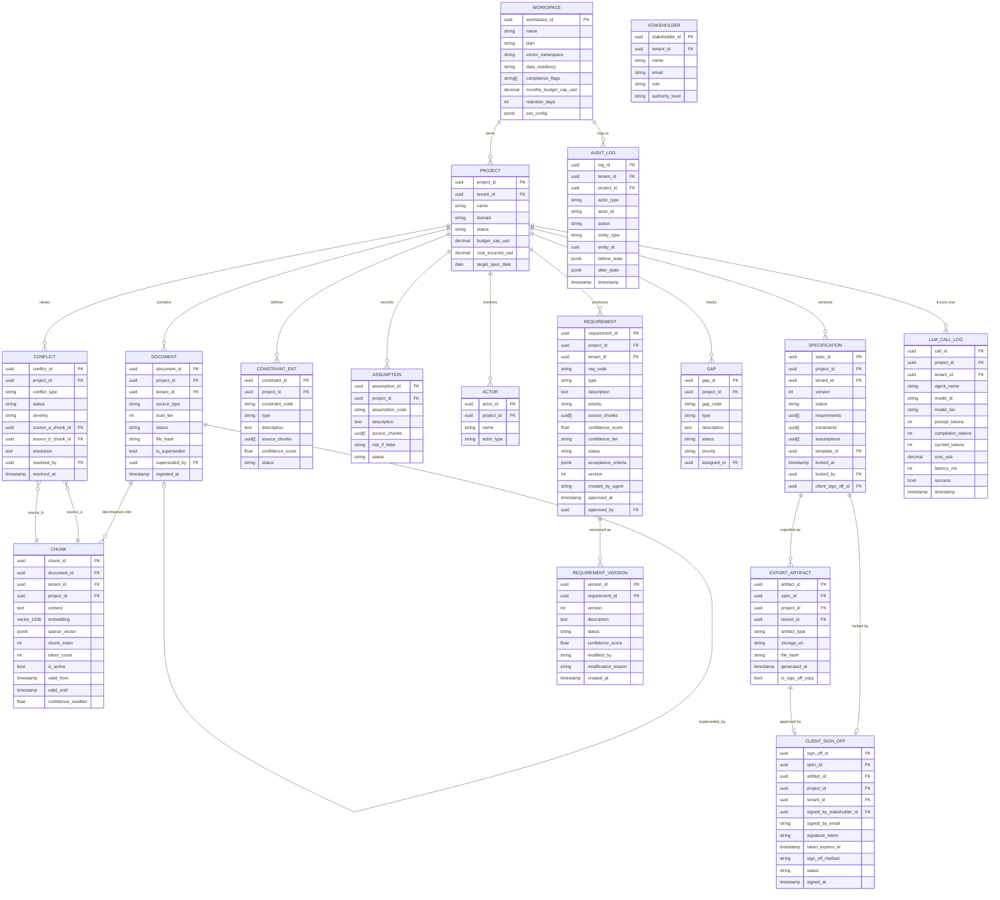

# Database Architecture

**Version:** 1.0 — Production Reference
**Audience:** Engineering · DBA · Architecture
**Stack:** PostgreSQL 16+ with pgvector · Row-Level Security · HNSW indexes

---

## Overview

Chitragupt uses a single PostgreSQL 16 instance extended with `pgvector` for both relational data and semantic vector search. This choice unifies ACID guarantees, multi-tenancy via Row-Level Security, and vector similarity search under one operational surface — avoiding the dual-system complexity of a separate vector database while meeting sub-500ms p95 retrieval latency targets.

The data model is the authoritative entity schema. See [`docs/architecture/ontology.md`](ontology.md) for complete field definitions, sub-schemas, and JSON contract examples. This document focuses on physical schema decisions, security policies, indexing strategy, and operational concerns.

---

## 1. Entity Relationship Diagram



---

## 2. Multi-Tenancy via Row-Level Security

Every table that contains tenant-specific data must have RLS enabled. This is the primary defense against cross-tenant data leakage. It is enforced at the database layer — not the application layer — so it cannot be bypassed by application bugs.

### 2.1 Standard RLS Policy

Applied identically to: `document`, `chunk`, `requirement`, `constraint`, `assumption`, `actor`, `conflict`, `gap`, `specification`, `export_artifact`, `client_sign_off`, `requirement_version`, `llm_call_log`, `session`.

```sql
-- Enable RLS on a table
ALTER TABLE chunk ENABLE ROW LEVEL SECURITY;

-- Isolation policy — applied to all operations (SELECT, INSERT, UPDATE, DELETE)
CREATE POLICY tenant_isolation ON chunk
    USING (tenant_id = NULLIF(current_setting('app.current_tenant_id', true), '')::uuid);

-- Superuser bypass for migrations and admin operations only
CREATE POLICY admin_bypass ON chunk
    USING (current_setting('app.is_admin', true) = 'true');
```

### 2.2 Setting the Tenant Context

The database service wrapper must set `app.current_tenant_id` at the start of every transaction. Application code must never issue raw database sessions without this wrapper.

```sql
-- At the start of every transaction (set by service wrapper, never by application code)
SET LOCAL app.current_tenant_id = '{{tenant_uuid}}';

-- All subsequent queries in this transaction are automatically scoped to this tenant
SELECT * FROM chunk WHERE project_id = $1 AND is_active = true;
-- ^ RLS silently appends: AND tenant_id = '{{tenant_uuid}}'
```

### 2.3 Audit Log Exception

`audit_log` is append-only and readable by admins across tenants (for compliance reporting). Its policy uses a different pattern:

```sql
ALTER TABLE audit_log ENABLE ROW LEVEL SECURITY;

-- Tenants can only read their own logs
CREATE POLICY tenant_read ON audit_log
    FOR SELECT USING (tenant_id = NULLIF(current_setting('app.current_tenant_id', true), '')::uuid);

-- Inserts allowed from all authenticated sessions (append-only)
CREATE POLICY append_only ON audit_log
    FOR INSERT WITH CHECK (true);

-- No UPDATE or DELETE ever — enforced by omitting those policies
```

---

## 3. Vector Store Schema (pgvector)

### 3.1 Chunk Table — Vector Column

```sql
CREATE EXTENSION IF NOT EXISTS vector;

CREATE TABLE chunk (
    chunk_id        UUID PRIMARY KEY DEFAULT gen_random_uuid(),
    document_id     UUID NOT NULL REFERENCES document(document_id),
    tenant_id       UUID NOT NULL,
    project_id      UUID NOT NULL,
    content         TEXT NOT NULL,
    embedding       VECTOR(1536) NOT NULL,          -- Dense embedding; dimension locked at creation
    sparse_vector   JSONB,                           -- BM25 sparse vector for hybrid search
    chunk_index     INTEGER NOT NULL,
    token_count     INTEGER NOT NULL,
    start_char      INTEGER,
    end_char        INTEGER,
    page_number     INTEGER,
    section_title   TEXT,
    valid_from      TIMESTAMPTZ NOT NULL DEFAULT NOW(),
    valid_until     TIMESTAMPTZ,
    is_active       BOOLEAN NOT NULL DEFAULT TRUE,
    source_type     TEXT NOT NULL,
    confidence_modifier FLOAT DEFAULT 0.0
);
```

**Embedding dimension is locked at `1536` for the lifetime of this vector namespace.** Mixing embedding models or dimensions within a namespace produces invalid similarity comparisons and is strictly prohibited. A model upgrade requires full re-embedding of all active chunks before queries are issued against the new model.

### 3.2 Mandatory Retrieval Filters

Every retrieval query must apply all four filters. Omitting any one of them is a critical security or correctness defect.

```sql
SELECT
    chunk_id,
    content,
    1 - (embedding <=> $query_embedding) AS similarity_score,
    metadata
FROM chunk
WHERE
    tenant_id   = $tenant_id          -- MANDATORY: tenant isolation (also enforced by RLS)
    AND project_id = $project_id      -- MANDATORY: project scope
    AND is_active  = true             -- MANDATORY: exclude tombstoned chunks
    AND (valid_until IS NULL OR valid_until > NOW())  -- MANDATORY: exclude expired knowledge
    AND 1 - (embedding <=> $query_embedding) >= 0.65  -- similarity threshold floor
ORDER BY embedding <=> $query_embedding
LIMIT 15;                             -- hard cap: max 15 chunks per query
```

### 3.3 Hybrid Search (Dense + Sparse)

For production retrieval, hybrid search combines dense vector similarity with BM25 sparse scoring and a cross-encoder re-ranker:

```sql
-- Step 1: Dense retrieval (top-50 candidates)
WITH dense AS (
    SELECT chunk_id, content, 1 - (embedding <=> $query_embedding) AS dense_score
    FROM chunk
    WHERE tenant_id = $tenant_id AND project_id = $project_id
      AND is_active = true AND (valid_until IS NULL OR valid_until > NOW())
    ORDER BY embedding <=> $query_embedding
    LIMIT 50
),
-- Step 2: Sparse retrieval via BM25 (application-layer, results joined here)
-- Step 3: Reciprocal Rank Fusion to merge dense + sparse
fused AS (
    SELECT chunk_id, (dense_score * 0.7 + sparse_score * 0.3) AS fused_score
    FROM dense JOIN sparse_results USING (chunk_id)
)
-- Step 4: Return top-15 for cross-encoder re-ranking (done in application layer)
SELECT chunk_id, content, fused_score
FROM fused
ORDER BY fused_score DESC
LIMIT 15;
```

---

## 4. Indexing Strategy

### 4.1 Vector Index — HNSW

```sql
-- Required once chunk table exceeds 50,000 active rows
-- Cosine distance operator class; HNSW for sub-second ANN search
CREATE INDEX CONCURRENTLY idx_chunk_embedding_hnsw
    ON chunk USING hnsw (embedding vector_cosine_ops)
    WITH (m = 16, ef_construction = 64);

-- Partial index: only active, non-expired chunks (reduces index size by ~30-40%)
CREATE INDEX CONCURRENTLY idx_chunk_embedding_active
    ON chunk USING hnsw (embedding vector_cosine_ops)
    WITH (m = 16, ef_construction = 64)
    WHERE is_active = true AND valid_until IS NULL;
```

**Index configuration:**
- `m = 16` — number of bi-directional links per node; increase to 32 for higher recall at cost of memory
- `ef_construction = 64` — build-time search width; increase to 128 for higher quality at cost of build time
- Set `SET hnsw.ef_search = 100` at query time for high-recall sessions

### 4.2 Relational Indexes

```sql
-- Tenant isolation — appears in every WHERE clause
CREATE INDEX idx_chunk_tenant_project ON chunk (tenant_id, project_id) WHERE is_active = true;
CREATE INDEX idx_requirement_tenant_project ON requirement (tenant_id, project_id);
CREATE INDEX idx_document_tenant ON document (tenant_id, status);

-- Audit log — time-series queries
CREATE INDEX idx_audit_tenant_time ON audit_log (tenant_id, timestamp DESC);
CREATE INDEX idx_audit_entity ON audit_log (entity_type, entity_id, timestamp DESC);

-- LLM cost aggregation
CREATE INDEX idx_llm_project_time ON llm_call_log (project_id, timestamp DESC);
CREATE INDEX idx_llm_tenant_time ON llm_call_log (tenant_id, timestamp DESC);

-- Requirement status filtering
CREATE INDEX idx_requirement_status ON requirement (project_id, status);

-- Chunk temporal filtering
CREATE INDEX idx_chunk_validity ON chunk (is_active, valid_until) WHERE valid_until IS NOT NULL;
```

---

## 5. Immutability Constraints

Certain records are append-only or immutable by design. These constraints are enforced at both the application layer and the database layer.

### 5.1 Audit Log — Append-Only Trigger

```sql
-- Prevent any UPDATE or DELETE on audit_log
CREATE OR REPLACE FUNCTION audit_log_immutable()
RETURNS TRIGGER AS $$
BEGIN
    RAISE EXCEPTION 'audit_log is append-only. Updates and deletes are prohibited.';
END;
$$ LANGUAGE plpgsql;

CREATE TRIGGER enforce_audit_immutability
    BEFORE UPDATE OR DELETE ON audit_log
    FOR EACH ROW EXECUTE FUNCTION audit_log_immutable();
```

### 5.2 Locked Specification — No Modification

```sql
-- Prevent changes to requirements of a locked specification
CREATE OR REPLACE FUNCTION check_spec_lock()
RETURNS TRIGGER AS $$
DECLARE
    spec_status TEXT;
BEGIN
    SELECT status INTO spec_status
    FROM specification
    WHERE spec_id = NEW.spec_id OR spec_id = OLD.spec_id;

    IF spec_status IN ('locked', 'approved') THEN
        RAISE EXCEPTION 'Specification is locked. Create a new version to make changes.';
    END IF;
    RETURN NEW;
END;
$$ LANGUAGE plpgsql;
```

### 5.3 Requirement Version — Append-Only

```sql
CREATE OR REPLACE FUNCTION requirement_version_immutable()
RETURNS TRIGGER AS $$
BEGIN
    RAISE EXCEPTION 'requirement_version is append-only.';
END;
$$ LANGUAGE plpgsql;

CREATE TRIGGER enforce_version_immutability
    BEFORE UPDATE OR DELETE ON requirement_version
    FOR EACH ROW EXECUTE FUNCTION requirement_version_immutable();
```

---

## 6. Cost Attribution

Every LLM call must be attributed before it is issued. Unattributed calls are prohibited.

```sql
-- Check budget before issuing an LLM call (called from application layer)
CREATE OR REPLACE FUNCTION check_project_budget(p_project_id UUID)
RETURNS TABLE (can_proceed BOOLEAN, budget_remaining_usd DECIMAL) AS $$
DECLARE
    v_cap DECIMAL;
    v_incurred DECIMAL;
BEGIN
    SELECT budget_cap_usd, cost_incurred_usd
    INTO v_cap, v_incurred
    FROM project WHERE project_id = p_project_id;

    IF v_cap IS NULL THEN
        RETURN QUERY SELECT TRUE, NULL::DECIMAL;
    ELSE
        RETURN QUERY SELECT (v_incurred < v_cap), (v_cap - v_incurred);
    END IF;
END;
$$ LANGUAGE plpgsql;

-- Update project cost after each LLM call (atomic with the call log insert)
CREATE OR REPLACE FUNCTION update_project_cost()
RETURNS TRIGGER AS $$
BEGIN
    UPDATE project
    SET cost_incurred_usd = cost_incurred_usd + NEW.cost_usd
    WHERE project_id = NEW.project_id;
    RETURN NEW;
END;
$$ LANGUAGE plpgsql;

CREATE TRIGGER sync_project_cost
    AFTER INSERT ON llm_call_log
    FOR EACH ROW EXECUTE FUNCTION update_project_cost();
```

---

## 7. Data Residency

Workspace-level `data_residency` settings constrain where data is stored and processed.

| Setting | Constraint |
|---|---|
| `us` | PostgreSQL and vector store in US-based infrastructure (default) |
| `eu` | PostgreSQL and vector store in EU region (AWS eu-west-1 or eu-central-1); LLM calls routed to EU endpoints |
| `apac` | APAC region; same rules as EU |
| `on_premise` | All data and LLM calls must remain on customer-controlled infrastructure; cloud LLM APIs prohibited |

**Implementation requirements:**
- Workspace `data_residency` must be checked at project creation and enforced at the infrastructure layer (connection strings, API endpoint selection).
- Cross-residency data movement is prohibited — a workspace set to `eu` may not have any data stored in US regions, including backups, replicas, or temporary files.
- LLM API calls for EU-residency workspaces must use the appropriate regional endpoint (e.g., Azure OpenAI EU, Anthropic's EU gateway).

---

## 8. Migration Strategy

### 8.1 Principles

- All schema changes are managed via migration files (Alembic or equivalent).
- Migrations are forward-only in production. Rollback is achieved by creating a new migration.
- Breaking migrations (column drops, type changes, RLS policy changes) require a maintenance window and advance notice to affected tenants.
- The embedding dimension (`VECTOR(1536)`) cannot be changed without a full re-embedding migration — treat it as permanent.

### 8.2 Migration Sequence for Sprint 0

```
0001_create_workspace.sql
0002_create_project.sql
0003_create_document.sql
0004_create_chunk_with_pgvector.sql          ← installs pgvector extension
0005_create_stakeholder.sql
0006_create_requirement.sql
0007_create_constraint_assumption_actor.sql
0008_create_conflict_gap.sql
0009_create_specification.sql
0010_create_export_artifact.sql
0011_create_client_sign_off.sql
0012_create_requirement_version.sql
0013_create_audit_log.sql
0014_create_llm_call_log.sql
0015_create_session.sql
0016_enable_rls_all_tables.sql               ← enables RLS + creates all policies
0017_create_indexes.sql                       ← relational indexes
0018_create_hnsw_index.sql                    ← deferred until chunk table populated
0019_create_immutability_triggers.sql
0020_create_cost_attribution_trigger.sql
```

### 8.3 Re-Embedding Migration Protocol

If the embedding model must be upgraded:

1. New embedding column added alongside the old one: `embedding_v2 VECTOR(NEW_DIM)`.
2. Background job re-embeds all active chunks in batches, writing to `embedding_v2`.
3. Once all active chunks have `embedding_v2` populated, the HNSW index is built on the new column.
4. Retrieval queries are switched to use `embedding_v2` in a single atomic deployment.
5. Old `embedding` column is dropped after a 14-day observation window.
6. Old HNSW index dropped and replaced.

---

## 9. Performance Targets

| Operation | Target | Notes |
|---|---|---|
| Semantic retrieval (top-15) | p95 < 500ms | With HNSW index and mandatory filters |
| Requirement read (single) | p99 < 50ms | Relational; served from connection pool |
| Specification write (lock) | < 200ms | Single transaction; triggers audit log |
| LLM call cost attribution | < 10ms | Trigger on `llm_call_log` insert |
| Audit log write | < 5ms | Append-only; no index contention |
| Budget cap check | < 20ms | Reads from `project` table with project_id PK lookup |

---

> Chitragupt Database Architecture · v1.0 · Production Reference · May 2026
