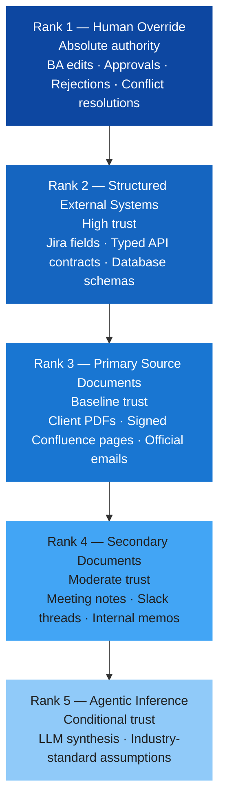
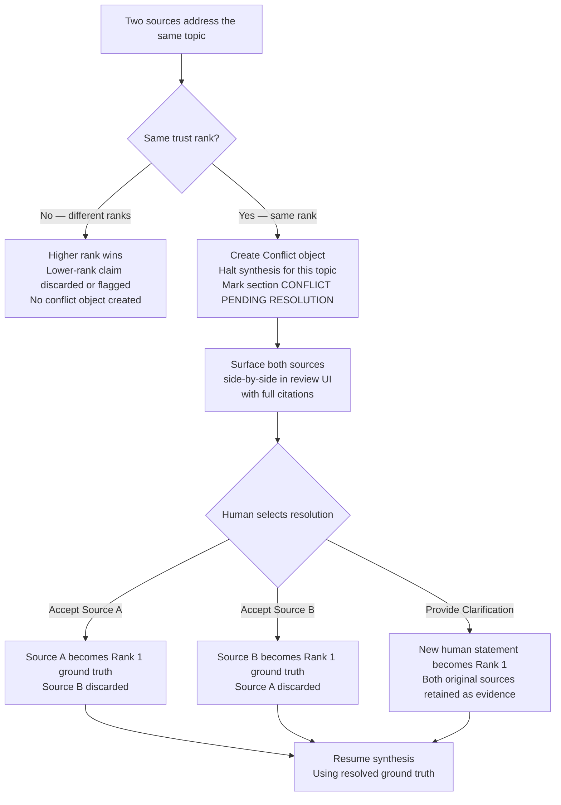

# Epistemology — Knowledge Acquisition & Trust Rules

**Version:** 3.0 — Strict Production Reference
**Audience:** Engineering · AI/ML · Architecture
**Status:** Binding. Any system behavior that violates a rule in this document is a defect, not a product decision.

---

## Purpose

Chitragupt's output is trusted by clients and used to commit engineering resources. A wrong requirement costs orders of magnitude more than a wrong search result. This document defines precisely how the system acquires, weights, validates, and emits knowledge — and what it must never do.

---

## 1. Trust Hierarchy

Every claim in a generated specification must be traceable to a source with an assigned trust rank. Higher ranks always win. Silent merging across ranks is prohibited.



**Strict rules:**
- A Rank 5 claim may never supersede or silently replace a Rank 3+ claim.
- When two sources of different rank conflict, the higher rank wins and the lower-rank claim is discarded or flagged — never merged.
- When two sources of the **same** rank conflict, see Section 4 (Conflict Protocol).
- Every claim in the output must declare its trust rank in the `source_chunks` metadata.

---

## 2. Confidence Scoring

Every synthesized output carries a calibrated confidence score (float, 0.0–1.0) computed from five weighted signals. The score determines the output's tag and whether it can appear in the specification.

### 2.1 Score Computation

| Signal | Weight | Description |
|---|---|---|
| Retrieval score | 40% | Cosine similarity between query and retrieved chunk |
| Re-ranking score | 30% | Cross-encoder score after initial retrieval — more precise than cosine |
| Source trust tier | 15% | Higher-tier sources (Rank 2–3) receive a confidence boost |
| LLM self-reported certainty | 10% | Discounted because LLMs are known to be overconfident |
| Historical validation rate | 5% | Empirical rate at which similar past inferences were approved by humans |

### 2.2 Confidence Tiers and Output Rules

| Score | Tier | Tag in Output | Action |
|---|---|---|---|
| 0.85–1.00 | Explicit Extraction | *(no tag)* | Include as-is |
| 0.65–0.84 | Deductive Synthesis | `[SYNTHESIZED]` | Include; surfaced in review |
| 0.40–0.64 | Inductive Inference | `[INFERRED — VERIFY]` | Include; also raised as Open Question |
| < 0.40 | Speculative | — | **Do not include.** Raise as Open Question instead |

**Hard rules:**
- Confidence tags must appear in both the database record and every rendered output (chat, DOCX, PDF, Mermaid export).
- Tags may only be removed from the final locked specification once a human has explicitly approved the requirement.
- Stripping a tag before human approval is a product defect.
- Visual extractions (diagrams, screenshots, video frames) have a hard confidence cap of **0.80** regardless of computed score. They always carry `[VISUAL EXTRACTION — VERIFY]`.

### 2.3 Calibration Requirements

A score of 0.70 must correspond to approximately 70% empirical correctness as judged by domain experts.

| Metric | Target |
|---|---|
| Brier Score | < 0.15 |
| Expected Calibration Error (ECE) | < 0.10 |
| Human rejection rate for claims scored > 0.85 | < 15% |

**Recalibration trigger:** If the human rejection rate for high-confidence claims (> 0.85) exceeds 15% over any 30-day rolling window, the confidence model is miscalibrated and must be reviewed before further processing continues.

**Calibration process:**
1. Sample 100 requirements from the evaluation dataset.
2. Have 2 domain experts independently rate each as: Correct / Incorrect / Partially Correct.
3. Plot predicted confidence vs. empirical accuracy (reliability curve).
4. Re-evaluate quarterly or after any LLM model version upgrade.

---

## 3. Traceability — The Provenance Contract

For a requirement to be valid, the system must be able to prove how it knows it. Provenance is not optional metadata — it is a structural property of every knowledge object.

### 3.1 Required Provenance Fields

Every generated requirement, constraint, and assumption must carry:

| Field | Type | Description |
|---|---|---|
| `source_chunks` | UUID[] | At least one active, non-tombstoned chunk in the vector store |
| `retrieval_score` | float | Cosine similarity at retrieval time |
| `rerank_score` | float | Cross-encoder score |
| `created_by_agent` | string | Agent ID that synthesized this requirement |
| `model_id` | string | Pinned model version used (e.g., `claude-sonnet-4-6`) |
| `created_at` | timestamp | UTC timestamp of synthesis |
| `confidence_score` | float | Final calibrated score |

### 3.2 Citation Format

Human-readable citations must appear in the review UI and all export formats alongside the requirement:

```
[Source: Payment_Gateway_V2.pdf, p.4 — Confidence: 0.92]
[Source: Jira Epic ENG-1234 — Confidence: 0.87]
[INFERRED from industry standard (GDPR Art.17) — Confidence: 0.61 — REQUIRES VALIDATION]
[VISUAL EXTRACTION — Architecture_Diagram.png — Confidence: 0.74 — VERIFY]
```

### 3.3 Orphan Knowledge

Any LLM-generated claim that cannot be mapped to at least one active chunk in the vector store is **Orphan Knowledge** — treated as a hallucination until proven otherwise.

**Required handling:**
- Never include Orphan Knowledge in the specification as a confirmed requirement.
- Must be raised as an Open Question (Gap) or tagged `[SPECULATIVE — REVIEW]` if tentatively included.
- The Review Agent must actively surface all Orphan Knowledge in the review session before any specification is approved.

---

## 4. Conflict Protocol

When two sources contradict each other, the system halts on that topic. It does not guess which source is correct under any circumstances.



### 4.1 Conflict Types

| Type | Example | System Action |
|---|---|---|
| Direct Contradiction | Source A: "Daily sync." Source B: "Real-time sync." | Conflict flag; halt synthesis |
| Scope Overlap | Feature X specified for Admin in Source A; for All Users in Source B | Conflict flag; synthesize both as candidates |
| Version Conflict | Same document exists in v1 (uploaded) and v2 (linked); they differ | Flag version discrepancy; use most recent by default; notify user |
| Implicit Contradiction | Feature implies SLA X; constraint document implies max SLA Y where X > Y | Inferred conflict; tag both; ask stakeholder to clarify |

### 4.2 Non-Negotiable Rule

An agent may not programmatically resolve a conflict between equal-rank sources. An agent may provide a recommendation (e.g., "Source B appears more recent") but the resolution action is exclusively a human action. Automated conflict resolution is a critical defect.

---

## 5. Temporal Validity

Knowledge has a temporal dimension. A fact that was true when a document was ingested may be false when that document is updated.

### 5.1 Chunk Validity Window

Every chunk carries:
- `valid_from` — timestamp of ingestion (mandatory)
- `valid_until` — timestamp of tombstoning (null while active)
- `is_active` — boolean; false for tombstoned chunks

**Rules:**
- Chunks with a non-null `valid_until` that has passed must be excluded from all retrieval queries. This filter may never be removed by a performance optimization, migration, or configuration change.
- When a document is re-ingested after an update, old chunks are tombstoned (`is_active = false`, `valid_until = NOW()`) — never hard-deleted. The traceability chain must remain queryable indefinitely.
- Requirements derived solely from tombstoned or expired chunks must be flagged for re-validation.

### 5.2 Staleness Detection

| Event | System Response |
|---|---|
| Source document updated (new upload) | Old chunks tombstoned; new chunks re-embedded; spec flagged for re-review |
| Connector source updated (Jira/Confluence webhook) | Diff-based re-embedding of changed sections only; staleness alert raised |
| Source not verified by a human in > 90 days | Requirements derived from it marked `[SOURCE MAY BE STALE — VERIFY]` |
| User marks a source as "superseded" | All chunks from that source excluded from future retrieval; linked requirements flagged |
| Spec is locked and approved | Contributing source chunks are snapshotted; subsequent changes to sources do not affect the locked spec |

The staleness threshold (default 90 days) is configurable per workspace.

---

## 6. Multi-Modal Trust

Inputs beyond plain text contribute knowledge differently. Each modality has a defined trust level and handling protocol.

| Modality | Trust Level | Handling |
|---|---|---|
| Plain text (PDF / DOCX) | Baseline | Direct extraction + chunking; tables require structured parsing |
| Spreadsheet (XLSX) | High — structured | Row = potential requirement; column headers define semantic schema |
| Diagram / Image | Moderate — vision | Vision LLM extraction; confidence hard-capped at 0.80; `[VISUAL EXTRACTION — VERIFY]` mandatory |
| Audio recording | Moderate | STT transcription → text pipeline; speaker attribution affects trust level |
| Video (screen recording) | Moderate | Frame extraction + transcription; treat as secondary confirmation, not primary source |
| Chat session (elicitation) | High — recency | Authoritative for the question asked; may conflict with older documents |
| URL / Web page | Baseline | `source_type: web`; authoritativeness not verifiable; cannot be cited as a primary source |

### 6.1 Vision Extraction Protocol

1. Vision-capable LLM invoked to describe diagram entities and relationships.
2. Extracted description embedded as a chunk with `source_type: visual_extraction` and `confidence_modifier: -0.15`.
3. All vision-derived claims tagged `[VISUAL EXTRACTION — VERIFY]` regardless of score.
4. Original image stored and linkable from citation viewer so the reviewer can manually verify the extraction.

---

## 7. Epistemic Language Rules

The language model must use output language that matches the confidence tier. Using certain language (`shall`, `must`) for inferred claims is a hallucination risk and a legal liability.

| Confidence | Required Language |
|---|---|
| ≥ 0.85 — Explicit | "The system **shall**..." (mandatory, normative) |
| 0.65–0.84 — Synthesized | "Based on [source], the system **should**..." |
| 0.40–0.64 — Inferred | "It is recommended that the system considers..." + `[INFERRED — VERIFY]` tag |
| < 0.40 | Do not generate. Raise as Open Question. |

No prompt, user preference, or runtime configuration may override this rule.

---

## 8. Out-of-Knowledge Scenarios

The system must know what it does not know and say so explicitly rather than speculate.

| Scenario | Required Response |
|---|---|
| No source chunk covers the topic | Open Question: "No information found for [topic]. Please provide clarification." |
| All retrieved chunks have confidence < 0.40 | Open Question; do not include speculative claim |
| Topic requires domain expertise beyond the ingested corpus | Open Question: "This topic may require SME input." |
| Topic explicitly marked out-of-scope in a source document | Do not generate requirement; note the exclusion with citation |
| Stakeholder input contradicts itself within a single session | Raise internal conflict; ask for clarification before proceeding |

---

## 9. Feedback Loops & Knowledge Improvement

Human reviewer behavior must feed back into the system's knowledge quality over time.

| Human Action | Signal | Effect |
|---|---|---|
| Approves a requirement | Positive for: retrieval query, chunks used, synthesis approach | Used in calibration; boosts similar chunks in future retrievals |
| Rejects a requirement | Negative; captures rejection reason | Chunk receives soft negative weight for this retrieval context |
| Edits a requirement | Delta between AI text and human edit is logged | Informs prompt template refinement |
| Resolves a conflict (chooses A or B) | Resolution pattern recorded | Similar conflicts in same domain use pattern as a soft hint |
| Marks `[INFERRED]` as valid | Validates inference pattern | Raises confidence floor for similar inferences in this domain |
| Marks `[INFERRED]` as invalid | Invalidates inference | Lowers confidence for similar inferences; triggers review of related claims |

### 9.1 Tenant Isolation of Feedback

- Feedback from Tenant A never directly modifies the knowledge base used by Tenant B.
- Cross-tenant learning is permitted only for: aggregate calibration statistics (no identifiable data), and anonymized conflict resolution patterns contributed to a shared library with explicit workspace opt-in.

---

## 10. Invariant Cross-References

This document works in conjunction with the invariants defined in [`sprint0/ARCHITECTURE.md`](../../sprint0/ARCHITECTURE.md). The binding rules that govern epistemological behavior are:

| Invariant | Rule |
|---|---|
| INV-EPI-01 | Every requirement must trace to at least one active source chunk |
| INV-EPI-02 | Agents may not autonomously resolve same-rank conflicts |
| INV-EPI-03 | Confidence tags mandatory for all output below 0.85 |
| INV-EPI-04 | Embedding model consistency — no mixed models within a namespace |
| INV-HITL-01 | Human edits are Rank 1 ground truth — agents may not overwrite |
| INV-HITL-05 | Locked specifications are immutable |

---

> Chitragupt Epistemology · v3.0 · Strict Production Reference · May 2026
