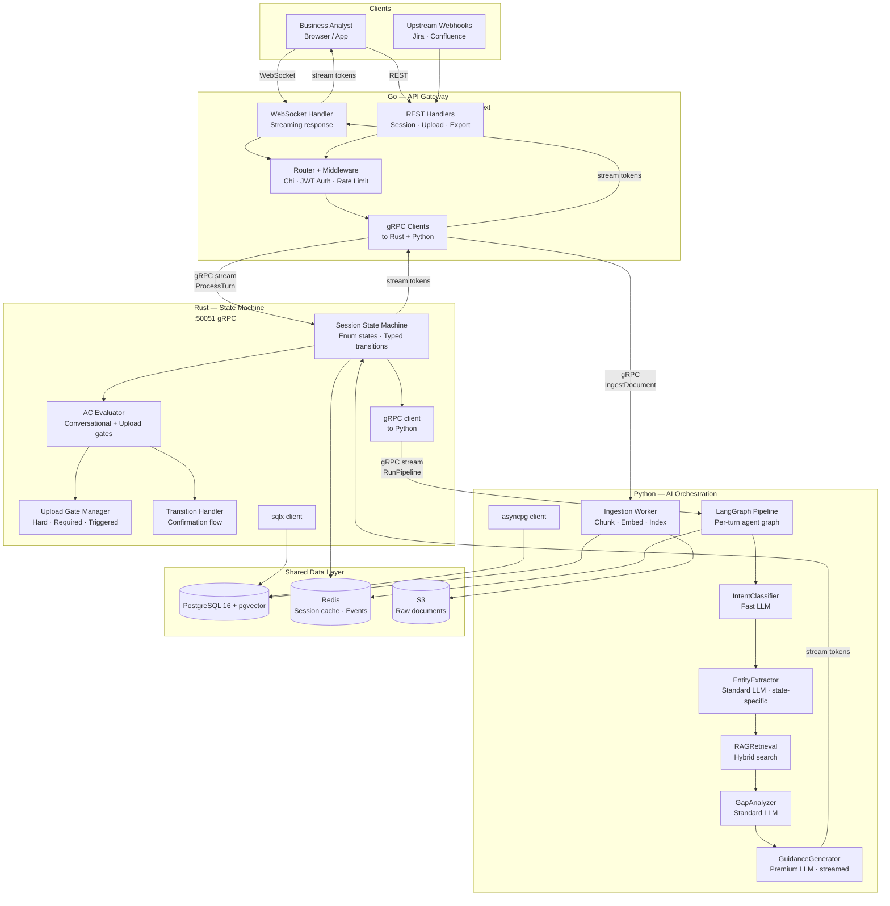
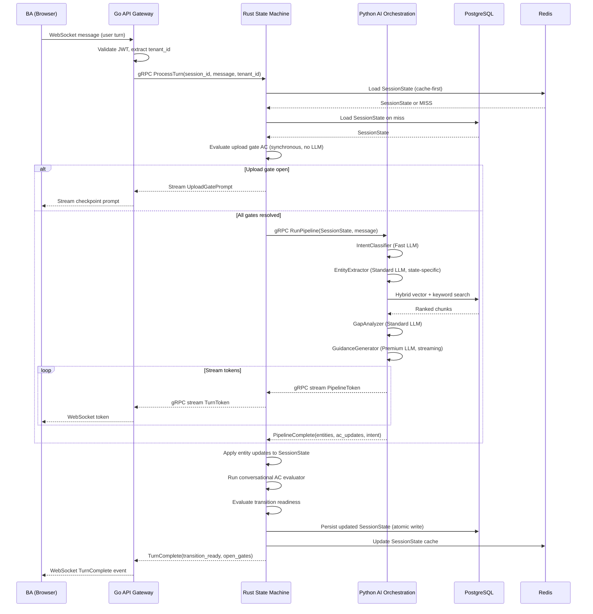

# Technical Stack — Chitragupt

**Version:** 1.0 — Authoritative
**Status:** Binding. Language assignments are architectural decisions. Changing the service language for any tier requires a new decision entry in `sprint0/DECISIONS.md`.

---

## Architecture Philosophy

Chitragupt is a three-service polyglot system. Each service is written in the language best suited to its computational profile:

| Service | Language | Why |
|---|---|---|
| State Machine | **Rust** | Deterministic, zero-GC, exhaustive compile-time state modeling |
| AI Orchestration / RAG | **Python** | Entire ML/LLM ecosystem is Python-first; LLM latency dominates all other costs |
| API Gateway | **Go** | High-throughput concurrent I/O; cheap goroutines for WebSocket fan-out; single-binary deploy |

The services are **separate processes** communicating over gRPC. They share PostgreSQL and Redis. No service calls another service's database directly — all cross-service data access goes through the owning service's gRPC interface or the shared stores with appropriate isolation.

---

## 1. System Architecture



---

## 2. Per-Turn Data Flow

This is what happens on every user message, end to end.



---

## 3. Service: Rust — State Machine

### Responsibility

The Rust service owns the session and is the sole authority on what state a session is in. It does not call LLMs. It evaluates AC, manages upload gates, executes transitions, and orchestrates calls to the Python AI service.

### Why Rust

- **Exhaustive pattern matching** — the compiler enforces that every state enum variant is handled in every match expression. Unhandled state transitions are compile errors, not runtime surprises.
- **Zero-GC** — no garbage collection pauses during AC evaluation or state transitions. Sessions are deterministic.
- **Ownership model** — prevents data races when multiple goroutine-driven requests touch the same session concurrently. The borrow checker enforces safe concurrent access at compile time.
- **Performance** — AC evaluation (30+ criteria per turn) is pure computation. Rust executes this in microseconds, adding zero perceptible latency to a pipeline already dominated by LLM seconds.
- **gRPC as a service** — runs as a standalone process, not a library. Clean API boundary. Go and Python never touch session state directly.

### State Machine Design

```rust
#[derive(Debug, Clone, PartialEq, Eq, Serialize, Deserialize)]
pub enum SessionPhase {
    ProblemIntake,
    StakeholderDiscovery,
    RequirementElicitation,
    ConstraintCapture,
    ArchitectureAlignment,
    ReviewAndSignOff,
    SignedOff,
}

impl SessionPhase {
    pub fn valid_transitions(&self) -> &[SessionPhase] {
        match self {
            Self::ProblemIntake        => &[Self::StakeholderDiscovery],
            Self::StakeholderDiscovery => &[Self::RequirementElicitation],
            Self::RequirementElicitation => &[Self::ConstraintCapture],
            Self::ConstraintCapture    => &[Self::ArchitectureAlignment],
            Self::ArchitectureAlignment => &[Self::ReviewAndSignOff],
            Self::ReviewAndSignOff     => &[Self::RequirementElicitation, Self::SignedOff],
            Self::SignedOff            => &[],
        }
    }

    pub fn evaluate_ac(&self, state: &SessionState) -> AcResult {
        match self {
            Self::ProblemIntake        => ac::evaluate_s1(state),
            Self::StakeholderDiscovery => ac::evaluate_s2(state),
            Self::RequirementElicitation => ac::evaluate_s3(state),
            Self::ConstraintCapture    => ac::evaluate_s4(state),
            Self::ArchitectureAlignment => ac::evaluate_s5(state),
            Self::ReviewAndSignOff     => ac::evaluate_s6(state),
            Self::SignedOff            => AcResult::terminal(),
        }
    }
}
```

The compiler rejects any `match` on `SessionPhase` that does not handle all 7 variants. Every AC evaluator function is enforced to exist at compile time.

### Key Libraries

| Library | Purpose |
|---|---|
| `tokio` | Async runtime |
| `tonic` | gRPC server and client (protobuf) |
| `sqlx` | Async PostgreSQL with compile-time query checking |
| `serde` / `serde_json` | Serialization of `SessionState` to/from PostgreSQL JSONB |
| `redis` (deadpool-redis) | Session cache with connection pooling |
| `thiserror` | Typed error handling |
| `tracing` + `tracing-subscriber` | Structured logging and distributed tracing |
| `prost` | Protobuf code generation |

### gRPC Interface (Rust exposes)

```protobuf
service StateEngine {
  // Primary entry point — streaming response
  rpc ProcessTurn(TurnRequest) returns (stream TurnEvent);

  // Session management
  rpc GetSessionState(SessionQuery) returns (SessionStateProto);
  rpc CreateSession(CreateSessionRequest) returns (SessionStateProto);

  // Upload events (fired by Go after ingestion completes)
  rpc NotifyUploadComplete(UploadCompleteEvent) returns (AcEvalResult);
}

message TurnEvent {
  oneof payload {
    StreamToken        token       = 1;  // LLM token, relay to client
    UploadGatePrompt   gate        = 2;  // Required checkpoint prompt
    TransitionOffer    transition  = 3;  // All AC met, offer to advance
    TurnComplete       complete    = 4;  // Turn fully processed
  }
}
```

---

## 4. Service: Python — AI Orchestration

### Responsibility

The Python service owns all LLM interactions, RAG retrieval, embedding, and document ingestion. It receives a `SessionState` and a user message and returns a stream of guidance tokens plus structured extraction results. It has no knowledge of state transitions — those are Rust's concern.

### Why Python

- **LLM SDKs** — Anthropic, OpenAI, Google, and every other provider's SDK is Python-first. Wrapper overhead is zero.
- **LangGraph** — the per-turn agent pipeline (IntentClassifier → EntityExtractor → RAGRetrieval → GapAnalyzer → GuidanceGenerator) is implemented as a LangGraph graph. LangGraph is Python-only.
- **Embedding and retrieval** — `voyageai`, `sentence-transformers`, `pgvector` Python client, BM25 libraries, and cross-encoder re-rankers are all Python packages.
- **Document processing** — `pypdf`, `python-docx`, `openpyxl`, `Pillow` for multi-modal ingestion.
- **Latency profile** — every LLM call takes 1–5 seconds. Python overhead (10–50ms) is noise.

### Key Libraries

| Library | Purpose |
|---|---|
| `langgraph` | Per-turn pipeline orchestration; stateful agent graph |
| `anthropic` | Primary LLM SDK (Claude Opus / Sonnet / Haiku); prompt caching |
| `openai` | Fallback LLM SDK |
| `voyageai` | Embedding model (voyage-large-2, 1536-dim) |
| `asyncpg` | Async PostgreSQL; pgvector extension queries |
| `grpcio` + `grpcio-tools` | gRPC server (exposes AI service to Rust) |
| `redis.asyncio` | Async Redis client |
| `pypdf` + `python-docx` + `openpyxl` | Document parsing (PDF, DOCX, XLSX) |
| `rank-bm25` | BM25 sparse vector generation |
| `boto3` | S3 document storage |
| `pydantic` | Structured output schemas for all LLM responses |
| `tenacity` | Retry logic with exponential backoff for LLM calls |
| `presidio-analyzer` | PII detection before embedding |
| `tracing-opentelemetry` | Distributed trace context propagation |

### LangGraph Pipeline (per turn)

```python
from langgraph.graph import StateGraph
from typing import TypedDict

class PipelineState(TypedDict):
    session_state: SessionStateProto
    user_message: str
    intent: str | None
    extracted_entities: list[Entity]
    retrieved_chunks: list[ChunkRef]
    gap_analysis: GapResult
    guidance_tokens: list[str]

def build_pipeline() -> StateGraph:
    graph = StateGraph(PipelineState)

    graph.add_node("classify_intent",   IntentClassifierNode())
    graph.add_node("extract_entities",  EntityExtractorNode())
    graph.add_node("retrieve_context",  RAGRetrievalNode())
    graph.add_node("analyze_gaps",      GapAnalyzerNode())
    graph.add_node("generate_guidance", GuidanceGeneratorNode())

    graph.add_edge("classify_intent",   "extract_entities")
    graph.add_edge("extract_entities",  "retrieve_context")
    graph.add_edge("retrieve_context",  "analyze_gaps")
    graph.add_edge("analyze_gaps",      "generate_guidance")

    graph.set_entry_point("classify_intent")
    graph.set_finish_point("generate_guidance")

    return graph.compile()
```

### gRPC Interface (Python exposes)

```protobuf
service AIOrchestration {
  // Primary pipeline — streaming token response
  rpc RunPipeline(PipelineRequest) returns (stream PipelineEvent);

  // Document ingestion (async; fires UPLOAD_COMPLETE event on finish)
  rpc IngestDocument(IngestRequest) returns (IngestAck);

  // Batch re-embedding (used for model upgrades)
  rpc ReEmbed(ReEmbedRequest) returns (stream ReEmbedProgress);
}

message PipelineRequest {
  SessionStateProto session_state = 1;
  string            user_message  = 2;
}

message PipelineEvent {
  oneof payload {
    StreamToken    token    = 1;  // guidance token
    EntityUpdate   entity   = 2;  // extracted entity (may arrive mid-stream)
    AcUpdate       ac       = 3;  // AC status change
    PipelineComplete complete = 4;
  }
}
```

### Prompt Caching

All LLM calls use Anthropic prompt caching. The system prompt (state context, AC instructions, output schema) is placed in a cached prefix block. Per-turn variable content (user message, retrieved chunks) follows the cached block. Target: ≥ 80% of prompt tokens served from cache.

```python
response = anthropic_client.messages.create(
    model="claude-sonnet-4-6",   # pinned — no floating aliases
    system=[
        {
            "type": "text",
            "text": SYSTEM_PROMPT_TEMPLATE,
            "cache_control": {"type": "ephemeral"},  # cached prefix
        }
    ],
    messages=[
        {"role": "user", "content": build_turn_prompt(state, message, chunks)}
    ],
    stream=True,
)
```

---

## 5. Service: Go — API Gateway

### Responsibility

Go is the public face of the system. It handles all client connections, validates JWTs, enforces rate limits, and proxies requests to the Rust and Python gRPC services. It has no business logic — it does not evaluate AC, call LLMs, or touch session state. It translates between WebSocket/REST (client-facing) and gRPC (internal).

### Why Go

- **Goroutines** — each WebSocket session gets its own goroutine (2KB stack vs 2MB thread). Thousands of concurrent BA sessions are cheap.
- **Streaming pipeline** — Go's channel model is ideal for forwarding streamed gRPC tokens from Rust → WebSocket → browser without buffering.
- **Single binary** — `go build` produces a self-contained binary. No runtime dependencies, no virtual environment. Deploy with `COPY chitragupt-api /usr/local/bin/`.
- **Standard library** — `net/http`, `crypto/tls`, and `encoding/json` are production-grade without third-party dependencies.
- **Low memory** — idle goroutine overhead is ~2KB. Python equivalent (asyncio task) is ~10–50KB. At 10,000 concurrent sessions, this is a 50–500MB difference.

### Key Libraries

| Library | Purpose |
|---|---|
| `chi` | HTTP router (lightweight, middleware-compatible) |
| `gorilla/websocket` | WebSocket upgrade + read/write loop |
| `google.golang.org/grpc` | gRPC clients for Rust and Python services |
| `golang-jwt/jwt/v5` | JWT validation (RS256; public key from auth provider) |
| `pgx/v5` | PostgreSQL driver (session lookup for auth) |
| `go-redis/v9` | Redis client (rate limiting, session lookup) |
| `uber-go/zap` | Structured logging |
| `prometheus/client_golang` | Metrics (request count, latency histograms, active sessions) |
| `rs/cors` | CORS middleware |

### Request Routing

```
WebSocket  /ws/sessions/{session_id}/chat     → Rust StateEngine.ProcessTurn (stream)
POST       /api/sessions                      → Rust StateEngine.CreateSession
GET        /api/sessions/{id}                 → Rust StateEngine.GetSessionState
POST       /api/sessions/{id}/upload          → Go: S3 upload → Python AIOrchestration.IngestDocument
                                               → Rust StateEngine.NotifyUploadComplete
GET        /api/sessions/{id}/export/{type}   → Python (BRD/HLD generation) → S3 presigned URL
POST       /api/sign-off/{token}              → Go: burn token → PostgreSQL update → Rust notify
GET        /health                            → 200 OK (liveness)
GET        /ready                             → check gRPC connections to Rust + Python (readiness)
```

### WebSocket Stream Handler

```go
func (h *Handler) ChatStream(w http.ResponseWriter, r *http.Request) {
    sessionID := chi.URLParam(r, "session_id")
    conn, _ := h.upgrader.Upgrade(w, r, nil)
    defer conn.Close()

    // Open gRPC stream to Rust state machine
    stream, _ := h.stateClient.ProcessTurn(r.Context(), &pb.TurnRequest{
        SessionId: sessionID,
        Message:   readMessage(conn),
        TenantId:  tenantFromJWT(r),
    })

    // Forward every gRPC event to the WebSocket — zero buffering
    for {
        event, err := stream.Recv()
        if err == io.EOF { break }
        conn.WriteJSON(toWSEvent(event))
    }
}
```

---

## 6. Service Communication

### gRPC as the Internal Protocol

All inter-service calls use gRPC with protobuf serialization. HTTP/REST is **not** used between services — only for external client communication.

```
Client  ──WebSocket──►  Go  ──gRPC──►  Rust  ──gRPC──►  Python
                         │                                    │
                    (REST upload)                       (IngestDocument)
                         │                                    │
                         └──────────────gRPC notify─────────►┘
                                    (UploadComplete)
```

**Why gRPC over REST between services:**
- Strongly typed contracts (`.proto` files version-controlled alongside code)
- Bidirectional streaming for token-by-token guidance delivery
- HTTP/2 multiplexing — multiple in-flight RPCs over a single TCP connection
- Generated client/server stubs in all three languages from a single `.proto` source

### Async Events: Redis Pub/Sub

For events that cross service boundaries without a synchronous caller waiting:

| Event | Publisher | Subscriber | Channel |
|---|---|---|---|
| `upload.complete` | Python (after ingestion finishes) | Rust (re-evaluates upload AC) | `events:upload:complete` |
| `budget.threshold` | Rust (after cost update) | Go (send alert email trigger) | `events:budget:threshold` |
| `sign_off.received` | Go (client burns token) | Rust (advance to SIGNED_OFF) | `events:signoff:received` |

### Protobuf Source of Truth

All `.proto` files live in `proto/` at the repo root. Generated stubs are committed (not generated at build time) to avoid toolchain version drift:

```
proto/
├── state_engine.proto       → Rust server + Go client
├── ai_orchestration.proto   → Python server + Rust client
└── common.proto             → SessionState, Entity, ChunkRef (shared messages)
```

---

## 7. Shared Infrastructure

All three services read from and write to the same PostgreSQL and Redis instances. Each service uses its own connection pool. No service issues queries to tables it does not own — enforcement is by convention and RLS (see `docs/architecture/DATABASE.md`).

| Store | Owned By | Read By | Purpose |
|---|---|---|---|
| PostgreSQL `session` table | Rust | Rust, Go (auth only) | Session state, persisted after every turn |
| PostgreSQL `chunk` / vector tables | Python | Python, Rust (indirectly) | Embeddings, retrieval |
| PostgreSQL `requirement`, `conflict`, etc. | Python | Rust (via entity updates) | Extracted knowledge entities |
| PostgreSQL `audit_log` | All | — | Append-only; each service writes its own events |
| PostgreSQL `llm_call_log` | Python | Rust (cost attribution) | Every LLM call; cost rolled up to project |
| Redis `session:state:{id}` | Rust | Rust | SessionState cache (5-min TTL, refreshed on every write) |
| Redis `events:*` | All | All | Pub/Sub channels (see above) |
| S3 `{tenant_id}/{project_id}/` | Python (writes), Go (presigned URLs) | Go | Raw uploaded documents and export artifacts |

---

## 8. Development Setup

### Repository Structure (to be created in Sprint 1)

```
chitragupt/
├── proto/                          Protobuf definitions (source of truth)
│   ├── state_engine.proto
│   ├── ai_orchestration.proto
│   └── common.proto
│
├── services/
│   ├── state-machine/              Rust — cargo workspace
│   │   ├── Cargo.toml
│   │   ├── src/
│   │   │   ├── main.rs
│   │   │   ├── state/             SessionPhase enum, SessionState, transitions
│   │   │   ├── ac/                AC evaluators (s1.rs through s6.rs)
│   │   │   ├── gates/             Upload gate manager
│   │   │   └── grpc/              tonic server implementation
│   │   └── build.rs               prost codegen from proto/
│   │
│   ├── ai-orchestration/          Python — uv-managed
│   │   ├── pyproject.toml
│   │   ├── src/
│   │   │   ├── pipeline/          LangGraph graph, agent nodes
│   │   │   ├── agents/            intent_classifier, entity_extractor, etc.
│   │   │   ├── rag/               retrieval, re-ranking, hybrid search
│   │   │   ├── ingestion/         chunking, embedding, PII scrubbing
│   │   │   └── grpc/              grpcio server implementation
│   │   └── proto/                 generated Python stubs (committed)
│   │
│   └── api-gateway/               Go — module
│       ├── go.mod
│       ├── cmd/server/main.go
│       ├── internal/
│       │   ├── handler/           HTTP + WebSocket handlers
│       │   ├── middleware/         JWT, rate limit, CORS
│       │   └── grpcclient/        Rust + Python gRPC clients
│       └── proto/                 generated Go stubs (committed)
│
├── sprint0/
├── sprint1/
└── docs/
```

### Local Development

Each service runs independently. Docker Compose wires them together for local integration:

```yaml
# docker-compose.yml (development)
services:
  state-machine:
    build: ./services/state-machine
    ports: ["50051:50051"]
    environment:
      DATABASE_URL: postgres://...
      REDIS_URL: redis://redis:6379
      AI_ORCHESTRATION_ADDR: ai-orchestration:50052

  ai-orchestration:
    build: ./services/ai-orchestration
    ports: ["50052:50052"]
    environment:
      DATABASE_URL: postgres://...
      ANTHROPIC_API_KEY: ${ANTHROPIC_API_KEY}
      VOYAGE_API_KEY: ${VOYAGE_API_KEY}

  api-gateway:
    build: ./services/api-gateway
    ports: ["8080:8080"]
    environment:
      STATE_MACHINE_ADDR: state-machine:50051
      AI_ORCHESTRATION_ADDR: ai-orchestration:50052
      JWT_PUBLIC_KEY: ${JWT_PUBLIC_KEY}

  postgres:
    image: pgvector/pgvector:pg16
    ports: ["5432:5432"]

  redis:
    image: redis:7-alpine
    ports: ["6379:6379"]
```

---

## 9. Key Architecture Decisions and Tradeoffs

### What this architecture is optimized for

| Property | How this stack delivers it |
|---|---|
| **Correctness** | Rust state machine — compile-time exhaustive AC evaluation; no unhandled state |
| **LLM throughput** | Python service scales independently; add workers without touching Go or Rust |
| **Connection scale** | Go goroutines — 10K concurrent WebSocket sessions at ~20MB total overhead |
| **Streaming UX** | gRPC bidirectional streaming + WebSocket forwarding — first token reaches client in ~200ms after LLM begins |
| **Operational simplicity** | Three binaries; shared PostgreSQL + Redis; no service mesh required at MVP scale |

### Known Tradeoffs

| Tradeoff | Mitigation |
|---|---|
| **Polyglot ops complexity** — three languages, three build toolchains | Standardize on Docker for all services; CI builds all three in parallel |
| **gRPC adds a hop** — Go → Rust → Python adds two internal network calls per turn | All services co-located in the same VPC/cluster; gRPC over loopback is ~0.1ms |
| **Proto schema changes are breaking** — changing a `.proto` message breaks all consumers | Version proto messages; use `optional` fields for additions; never remove or renumber fields |
| **Python GIL** — single-threaded LLM calls if not managed | Each LLM call runs in a separate asyncio task; use `uvicorn` with multiple workers for multi-core |
| **Rust learning curve** — fewer engineers know Rust vs Go/Python | State machine is the most bounded, well-specified component — a good entry point for learning Rust in this codebase |

### What this stack defers

- **Frontend** — React or similar; separate repo; communicates with Go API only.
- **Message queue** — NATS or Kafka replaces Redis pub/sub when event volume exceeds Redis comfort zone. Redis is sufficient for MVP.
- **Service mesh** — Envoy/Istio unnecessary at MVP scale. Revisit when services are on separate hosts under independent load.

---

## 10. Model Versions (Pinned)

All model identifiers in the Python service must be pinned. No floating aliases.

| Role | Model ID | Tier |
|---|---|---|
| Guidance generation (BRD / HLD) | `claude-opus-4-7` | Premium |
| Requirement extraction, gap analysis | `claude-sonnet-4-6` | Standard |
| Intent classification, routing | `claude-haiku-4-5-20251001` | Fast |
| Fallback (cross-vendor) | `gemini-2.0-flash` | Standard fallback |
| Embeddings | `voyage-large-2` · `1536` dim | Embedding |

Model upgrades are treated as deployment events: tested against the evaluation dataset, confirmed against quality thresholds, and promoted to production via a config change — never by changing a default or alias.

---

> Chitragupt Technical Stack · v1.0 · Authoritative · May 2026
