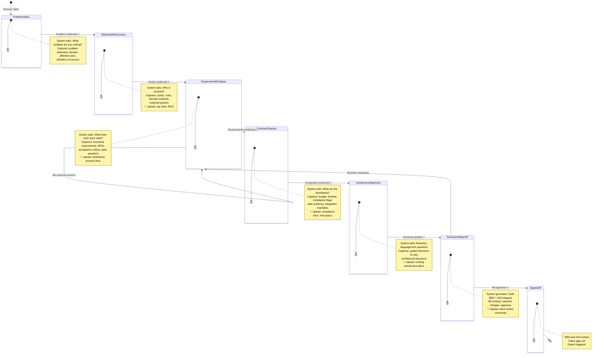

# 01 — The BA Journey

## What this is

A Business Analyst starts a session with nothing but a problem in their head. Chitragupt leads them — one question at a time — through seven phases until a signed-off BRD and architecture diagram lands in the client's inbox. The BA never fills out a form. The system always knows what to ask next.

This diagram shows the full journey, what gets captured at each phase, and where documents can be uploaded to improve confidence in the output.

---

## The Journey

---

## Key Rules

**The system always leads.** Every phase starts with the system asking a focused question, not the BA filling in a field.

**Transitions require confirmation.** The system presents a summary of what it captured and waits for the BA to say "yes, that's right" before advancing. The BA is never surprised by where the session ends up.

**Uploads improve confidence, not gate progress.** Most uploads are optional — the BA can proceed without them. The system notes absences and lowers confidence scores on affected requirements. A few uploads are hard-blocked (e.g., the client signature to reach Signed Off).

**Revision is always safe.** The BA can return to any prior phase at any time. Captured data is preserved; the session re-enters that phase and picks up from the last unanswered gap.
