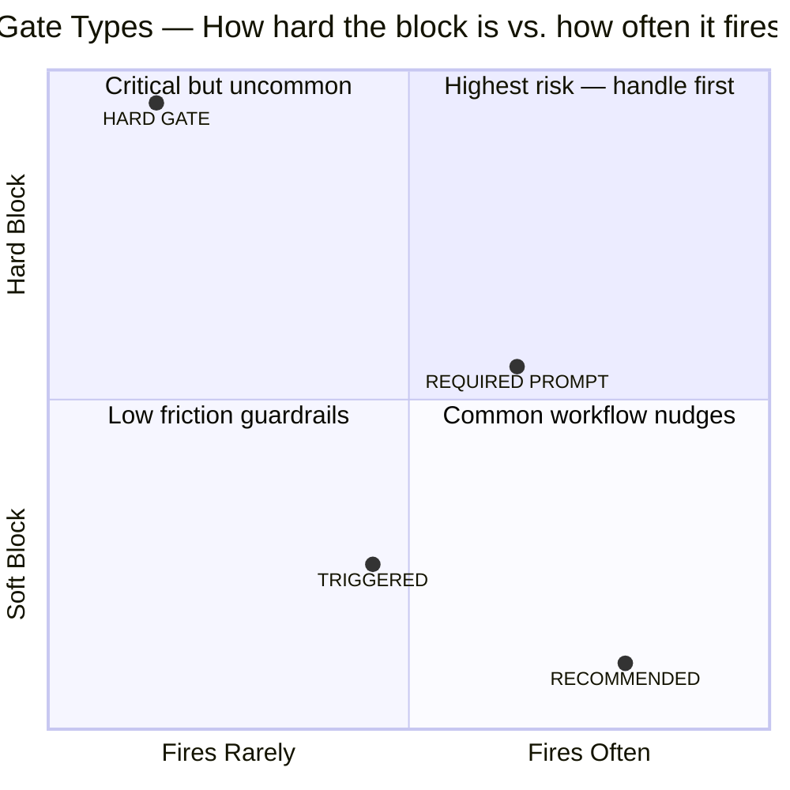
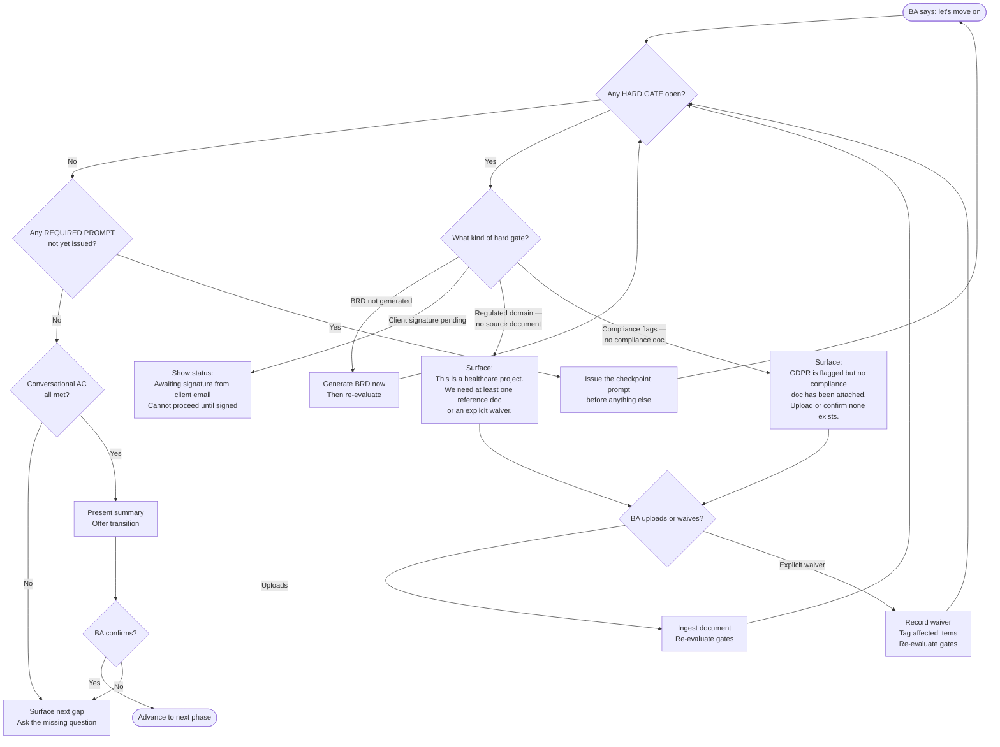
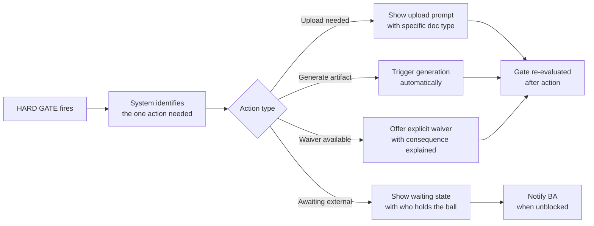

# 02 — Hard Gates

## What this is

A gate is a condition that must be resolved before the session can move forward. Without gates, the system could produce a signed BRD with no compliance documentation for a healthcare project, or lock a specification without a client signature. Gates prevent those outcomes.

Not all gates are equal. Some stop the world. Some just ask a question. This document explains the four gate types and why each exists.

---

## The Four Gate Types

| Gate Type | What it does | Can the BA skip it? |
|---|---|---|
| **HARD GATE** | Transition is unreachable. Full stop. | No |
| **REQUIRED PROMPT** | System must ask the question before offering to advance. BA may then say no. | Yes — but the question must be asked |
| **TRIGGERED** | System detects a reference and asks. BA can decline. Decline is recorded. | Yes — confidence impact noted |
| **RECOMMENDED** | System suggests once. BA may ignore entirely. | Yes — no impact |

---

## Why Hard Gates Exist

---

## The Hard Gates in This System

| Gate | Transition | Why it cannot be skipped |
|---|---|---|
| Client signature | Review → Signed Off | A BRD without a client signature is not a deliverable — it is a draft |
| BRD artifact exists | Review → Signed Off | Cannot approve a document that has not been generated and stored |
| HLD artifact exists | Review → Signed Off | The architecture diagram is a required deliverable, not optional |
| Source document (regulated domain) | Elicitation → Constraints | Healthcare, fintech, and government requirements with zero grounding have unacceptable liability risk |
| Existing architecture doc (if system exists) | Constraints → Alignment | Architecture decisions made without knowing the existing system will likely contradict it |

---

## What Happens When a Gate Fires

The system does not say "error." It surfaces exactly one resolution action — the simplest possible thing the BA can do to unblock progress.

The BA never sees a wall of errors. They see one message: what the gate is, and the single next step to resolve it.
