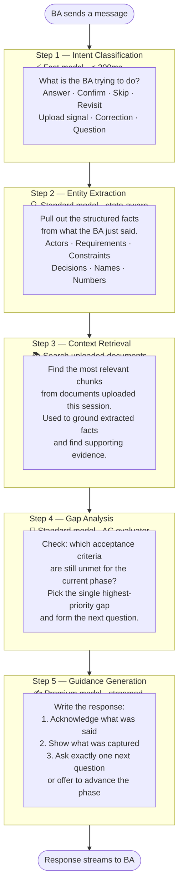
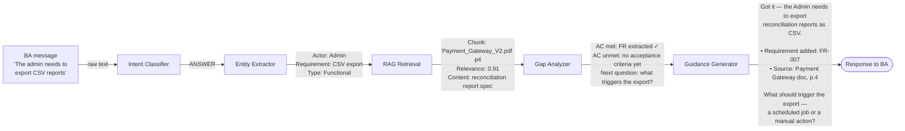
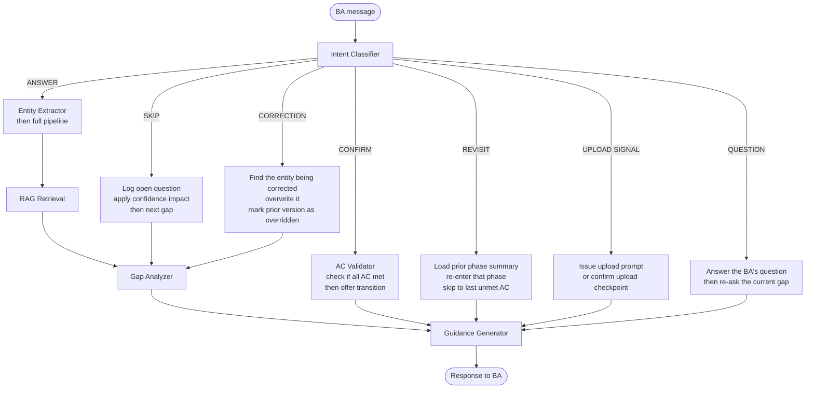

# 03 — Per-Turn Pipeline

## What this is

Every time the BA sends a message, the system runs a five-step pipeline before responding. Each step has a single job. The output of one step feeds the next. The pipeline always ends with exactly one action for the BA: a question, a confirmation prompt, or a gate resolution request.

This diagram shows what happens inside the system on each turn — in plain terms.

---

## The Five Steps



---

## What Each Step Produces



---

## How Intent Changes the Route

Not every message goes through all five steps the same way. The intent determines which path is taken.



---

## The Response Contract

No matter what path the pipeline takes, every response follows this structure. The Guidance Generator is constrained to produce exactly this — no walls of text, no open-ended rambling.

```
Acknowledge   →  One sentence. What you heard, paraphrased.
Captured      →  0 to 3 bullets. What was extracted and added to the session.
               (omitted if nothing new was captured)
Next action   →  One sentence only. A question, a transition offer,
               or a gate resolution prompt.
```

The BA always knows exactly what to do next. That is the guarantee this pipeline exists to deliver.
