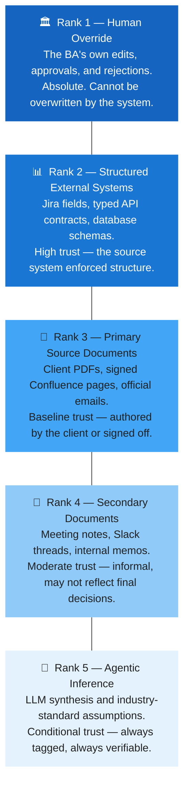
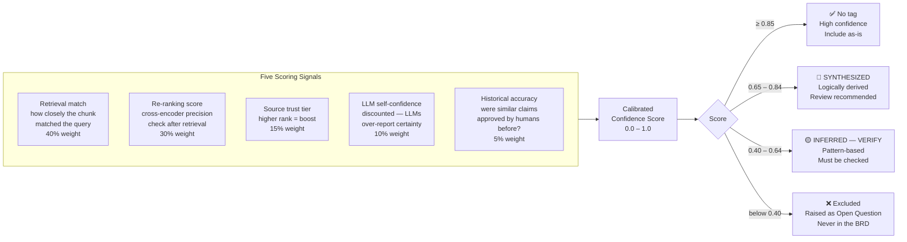
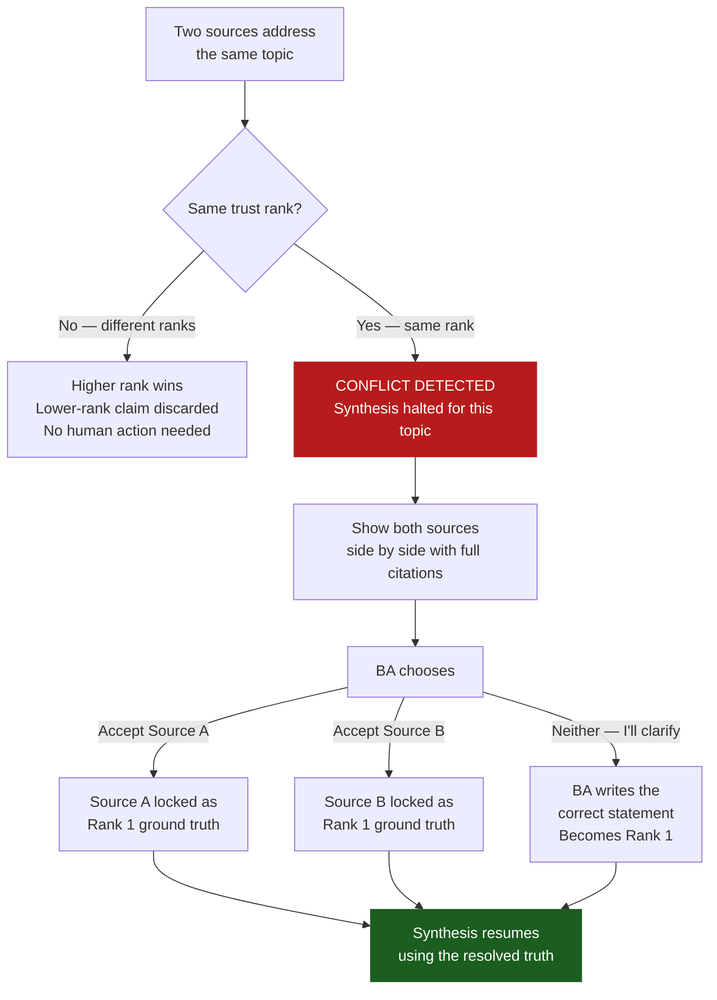
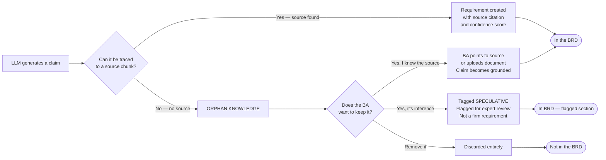

# 04 — Knowledge & Trust

## What this is

Chitragupt reads dozens of documents, hours of conversation, and sometimes conflicting information from multiple sources. It needs a principled way to decide: what do I believe, how confident am I, and what do I do when sources disagree?

The answer is a trust hierarchy combined with a confidence scoring system. Together they determine whether a requirement appears in the BRD as a firm commitment, a suggestion, or an open question — and what happens when two sources say different things.

---

## The Trust Hierarchy

Not all information is equally reliable. The system assigns every piece of knowledge a rank based on where it came from. Higher rank always wins.

**The key rule:** A Rank 5 inference can never silently replace a Rank 3 document. If the LLM thinks it knows better than what the client wrote — it is wrong.

---

## How Confidence Scores Work

Every requirement the system produces carries a score from 0 to 1. The score is computed from five signals and determines what tag — if any — appears next to the requirement.

**Visual extractions** — anything pulled from a diagram or screenshot — have a hard cap of 0.80 regardless of score, and always carry the `[VISUAL EXTRACTION — VERIFY]` tag. A diagram is an illustration, not a contract.

---

## What Happens When Sources Conflict

The system never resolves a conflict on its own. It stops, surfaces both sides, and waits for the BA.

**Why this matters:** Chitragupt is used to commit engineering work. A requirement produced by silently picking one conflicting source over another is a liability. The BA — who knows the client — must make that call, not the model.

---

## Orphan Knowledge — The Hard Line

Any claim the LLM produces that cannot be traced back to at least one source chunk is called **Orphan Knowledge**. It is treated as a hallucination.

The BRD is only as trustworthy as its sources. A requirement with no source is a guess dressed as a commitment.
