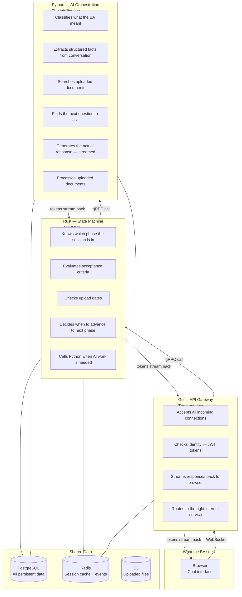
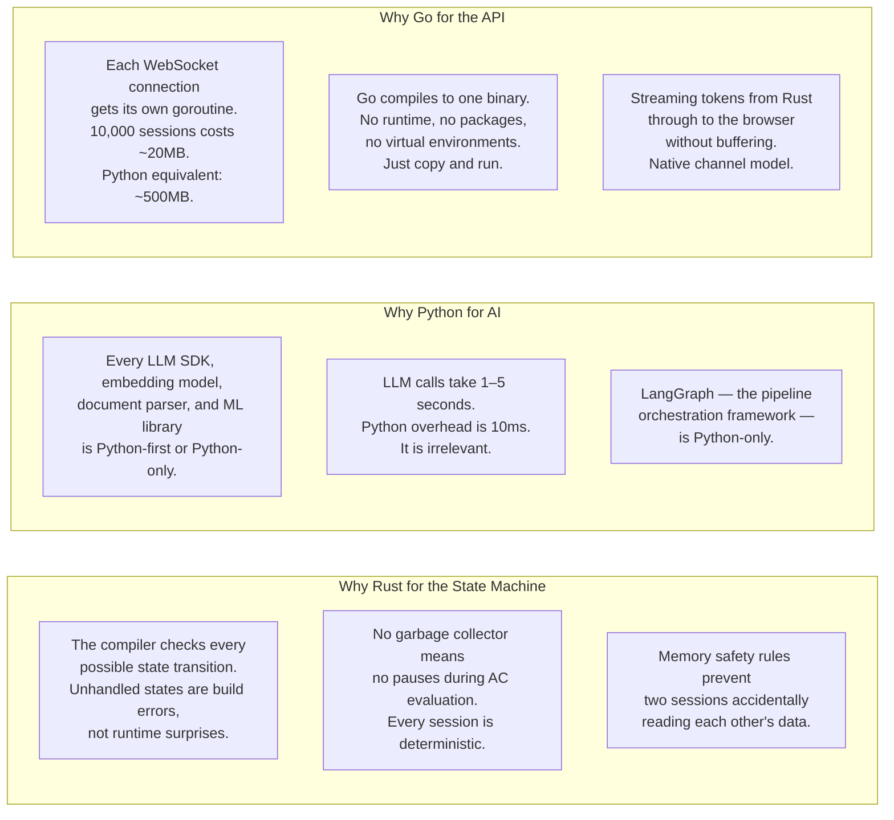
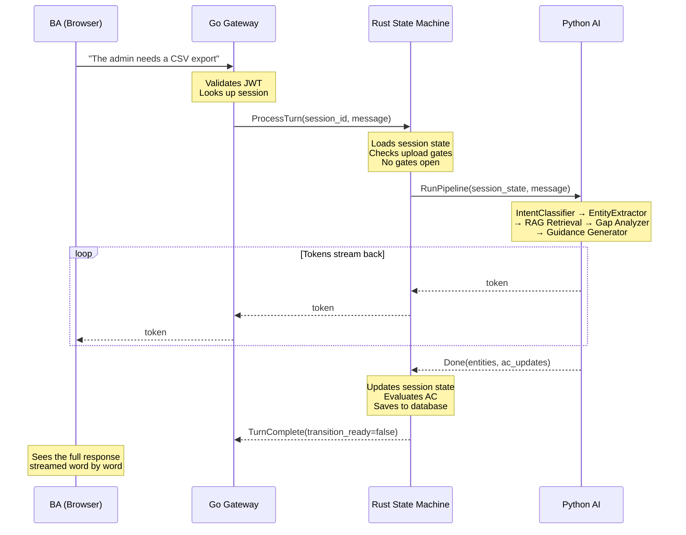
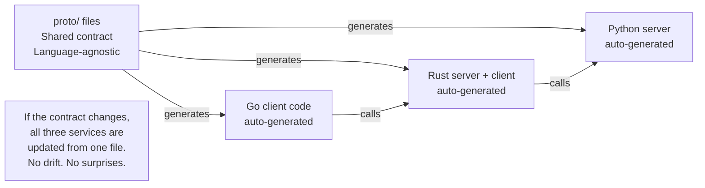

# 05 — System Services

## What this is

Chitragupt is built from three services, each written in a different language. This is not complexity for its own sake — each language was chosen because it is genuinely the best tool for that job. The three services never share code. They talk to each other over a well-defined protocol (gRPC).

This document explains what each service is responsible for and why that language was chosen — in plain terms.

---

## The Three Services

---

## Why Each Language

---

## How a Message Travels Through the System

---

## What Each Service Knows — and Doesn't

A key design principle: each service has a single area of authority. It does not reach into another service's domain.

| | Go | Rust | Python |
|---|---|---|---|
| **Knows about** | HTTP, WebSocket, auth, routing | Session state, AC, phase transitions, gates | LLMs, RAG, extraction, document processing |
| **Does not know about** | AC criteria, LLMs, session state | LLM APIs, document parsing, embeddings | State transitions, phase logic, gate rules |
| **Owns in the database** | Nothing (reads session for auth only) | `session` table | `chunk`, `requirement`, `llm_call_log`, `document` tables |
| **What happens if it goes down** | No new connections accepted | Sessions freeze mid-turn | AI responses stop; state machine waits |

This separation means each service can be scaled, upgraded, or replaced independently. A faster embedding model in Python does not require touching Go or Rust. A new gate rule in Rust does not require touching the LLM prompts.

---

## The Communication Protocol

The three services talk to each other using **gRPC** — a strongly typed, high-performance protocol used across the industry for exactly this kind of multi-language system.

The `.proto` files are the single source of truth for how the services communicate. Every field, every message, every API call is defined there — in one place, version-controlled with the rest of the code.
