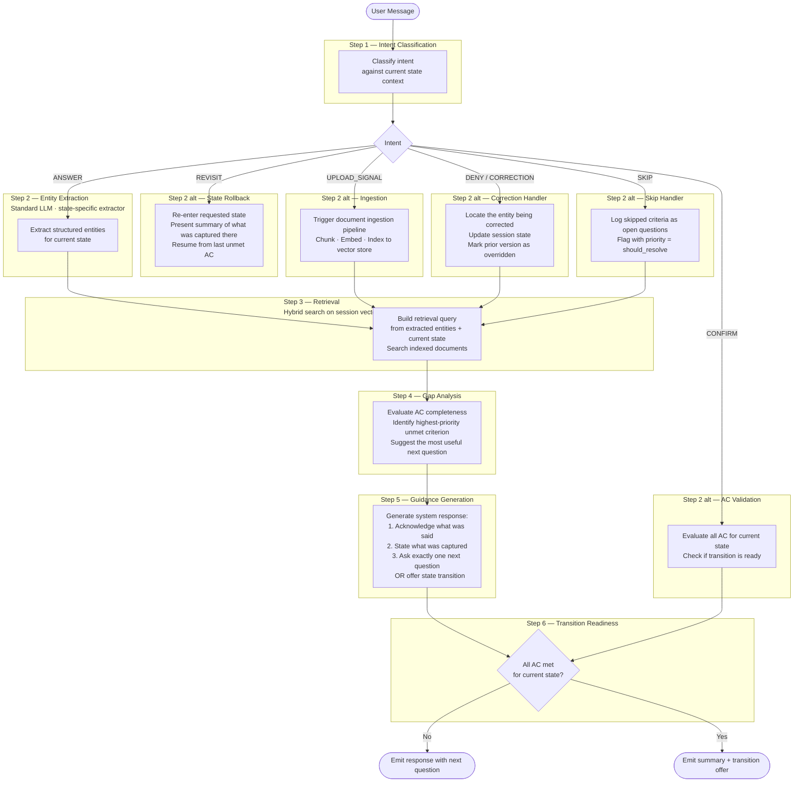
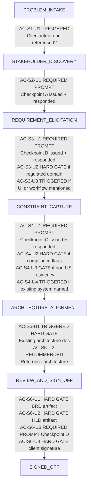
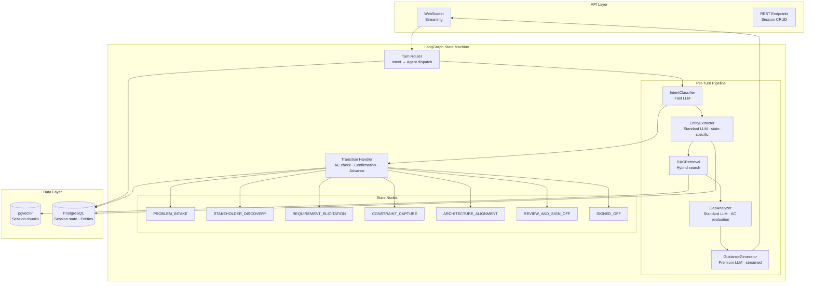

# Sprint 1 — Core Engine: Intent-Driven State Machine + RAG Pipeline

**Sprint Theme:** Build the system's ability to guide a user through every phase of the BA journey — one step at a time, grounded in what they've said and uploaded.

**Priority Principle:** Every engineering decision in Sprint 1 must ask: *does this make the system better at knowing what to ask next?* Feature completeness comes later. Guidance quality comes first.

**Sprint Goal:** A fully functional, conversation-driven state machine where a BA can go from "I have a problem" to "I have a confirmed requirements list" — with the system leading at every turn via intent-aware, RAG-grounded guidance.

---

## The Core Engine Concept

Sprint 1 builds one thing: **the engine that knows where the user is, what they still need to tell us, and what to ask next.**

Three components work together on every user message:

1. **State Machine** — tracks which phase the session is in and enforces that transitions only happen when measurable acceptance criteria are met.
2. **Per-Turn LLM Pipeline** — classifies intent, extracts structured entities, retrieves relevant context, evaluates gaps, and generates the next system message.
3. **Next-Step Guidance** — every system response must end with exactly one clear action for the user: a question, a confirmation prompt, or a transition offer. Never a wall of text with no direction.

The user should never wonder "what do I do next?" That is a system failure.

---

## 1. State Machine Design

### 1.1 States and Transitions

```mermaid
stateDiagram-v2
    direction LR

    [*] --> PROBLEM_INTAKE : Session created

    PROBLEM_INTAKE --> STAKEHOLDER_DISCOVERY : AC-S1 met + BA confirms

    STAKEHOLDER_DISCOVERY --> REQUIREMENT_ELICITATION : AC-S2 met + BA confirms

    REQUIREMENT_ELICITATION --> CONSTRAINT_CAPTURE : AC-S3 met + BA confirms
    REQUIREMENT_ELICITATION --> REQUIREMENT_ELICITATION : Gap surfaced\nSystem probes deeper

    CONSTRAINT_CAPTURE --> ARCHITECTURE_ALIGNMENT : AC-S4 met + BA confirms

    ARCHITECTURE_ALIGNMENT --> REVIEW_AND_SIGN_OFF : AC-S5 met + BA confirms

    REVIEW_AND_SIGN_OFF --> REQUIREMENT_ELICITATION : BA requests revision
    REVIEW_AND_SIGN_OFF --> SIGNED_OFF : AC-S6 met + BA approves

    SIGNED_OFF --> [*]
```



### 1.2 State Properties

Each state in the LangGraph graph carries the following typed properties on the session state object:

```python
class SessionState(TypedDict):
    # Identity
    session_id: str
    project_id: str
    tenant_id: str
    user_id: str

    # Current position
    current_state: Literal[
        "PROBLEM_INTAKE",
        "STAKEHOLDER_DISCOVERY",
        "REQUIREMENT_ELICITATION",
        "CONSTRAINT_CAPTURE",
        "ARCHITECTURE_ALIGNMENT",
        "REVIEW_AND_SIGN_OFF",
        "SIGNED_OFF",
    ]

    # Extracted knowledge (append-only within session)
    problem_statement: str | None
    business_domain: str | None
    affected_user_types: list[str]
    definition_of_success: str | None
    actors: list[Actor]
    requirements: list[DraftRequirement]
    constraints: list[DraftConstraint]
    assumptions: list[DraftAssumption]
    decision_directions: dict[str, str]     # decision_id → guided direction

    # AC tracking
    ac_met: list[str]                       # e.g. ["AC-S1-1", "AC-S1-3"]
    ac_unmet: list[str]                     # remaining criteria for current state
    open_questions: list[OpenQuestion]

    # Conversation
    messages: list[Message]                 # full history
    last_system_question: str              # what we just asked
    last_intent: str                        # classified intent of last user turn

    # Retrieval
    indexed_document_ids: list[str]        # docs uploaded and indexed this session
    last_retrieved_chunks: list[ChunkRef]  # chunks used in last synthesis

    # Cost tracking
    session_cost_usd: float
    turn_count: int
```

### 1.3 Transition Rules

A state transition must satisfy **all three conditions**:

1. Every AC defined for that transition is evaluated as `PASS`.
2. The system has presented a summary of what was captured in the current state.
3. The BA has responded with an explicit confirmation (`CONFIRM` intent).

If AC-1 and AC-2 are met but the BA has not confirmed, the system presents the summary and waits. It does not transition automatically.

If some AC are unmet when the BA says "let's move on," the system surfaces the unmet criteria explicitly before offering to proceed: *"We still don't have X and Y — do you want to continue anyway and fill these in later?"* Proceeding without met AC is allowed but creates open questions for those criteria.

---

## 2. Per-Turn LLM Pipeline

Every user message triggers this pipeline in sequence. No step is skippable.



### 2.1 Intent Types

| Intent | Description | Triggered When |
|---|---|---|
| `ANSWER` | BA is providing information requested | Substantive text that contains new knowledge |
| `UPLOAD_SIGNAL` | BA indicates a file has been or will be uploaded | Message references a document, file, or attachment |
| `CONFIRM` | BA is accepting the system's summary or proposal | "yes", "correct", "looks good", "proceed", "that's right" |
| `DENY` | BA is rejecting or correcting something | "no", "that's wrong", "actually", corrections to prior extractions |
| `REVISIT` | BA wants to go back to a prior phase | "can we revisit", "I need to change the stakeholders", "go back to" |
| `SKIP` | BA wants to move on without answering | "skip this", "I don't know", "not applicable", "come back to this" |
| `CLARIFICATION_REQUEST` | BA is asking the system a question | Question directed at the system, not an answer |
| `UPLOAD_COMPLETE` | A document has finished ingestion and is now indexed | System event fired by ingestion pipeline on successful completion; triggers a re-evaluation of upload AC |
| `OUT_OF_SCOPE` | BA's message is off-topic for the current phase | Unrelated queries; handled with a gentle redirect |

---

## 3. Agent Roster

Five agents operate within the pipeline. Each has a fixed model tier ceiling.

| Agent | Model Tier | Role | Output |
|---|---|---|---|
| `IntentClassifierAgent` | Fast | Classify the intent of every user turn | Intent enum + confidence score |
| `EntityExtractorAgent` | Standard | Extract structured data from natural language | Typed entities for current state |
| `RAGRetrievalAgent` | — (retrieval, not LLM) | Hybrid semantic + keyword search over session documents | Ranked chunks with scores |
| `GapAnalyzerAgent` | Standard | Evaluate AC completeness; identify highest-priority missing info | AC status list + next question recommendation |
| `GuidanceGeneratorAgent` | Premium | Compose the final system response with acknowledgment + next step | System message string (streamed) |

Agents are LangGraph nodes. They share the `SessionState` object and communicate exclusively through it. No agent calls another agent directly.

---

## 4. Acceptance Criteria per State Transition

These criteria are the engine's "readiness evaluator." Each criterion is a discrete, programmatically checkable condition on the session state. The `GapAnalyzerAgent` evaluates them after every turn.

---

### Transition: PROBLEM_INTAKE → STAKEHOLDER_DISCOVERY

**AC-S1-1** `problem_statement` is non-null and contains ≥ 50 characters.

**AC-S1-2** `business_domain` is classified and matches one of the known domains: `fintech`, `healthcare`, `ecommerce`, `logistics`, `saas_b2b`, `government`, `general`.

**AC-S1-3** `affected_user_types` contains ≥ 1 entry.

**AC-S1-4** `definition_of_success` is non-null — the BA has described what "done" looks like, even informally.

**AC-S1-5** BA has responded with `CONFIRM` intent to the system's problem summary.

**AC-S1-U1 (Client Intent Document — Triggered)** If during this phase the BA references an existing project brief, discovery document, scope statement, or client-provided intent document, the system must issue an upload prompt before the transition offer is made. One of the following must be true before proceeding: (a) the referenced document has been uploaded and indexed, OR (b) the BA has explicitly declined upload. If a document was referenced but neither condition is met, the transition offer is withheld. If the BA declines upload, all entities extracted from this phase retain `trust_tier = 4` (secondary document level) rather than being elevated to tier 3.

**Failure behavior:** For each unmet criterion, the Gap Analyzer selects the highest-priority gap and the Guidance Generator asks exactly that question. Order: AC-S1-1 → AC-S1-2 → AC-S1-3 → AC-S1-4 → AC-S1-U1 (if triggered) → AC-S1-5.

---

### Transition: STAKEHOLDER_DISCOVERY → REQUIREMENT_ELICITATION

**AC-S2-1** `actors` contains ≥ 2 entries.

**AC-S2-2** At least 1 actor has `authority_level = decision_maker`.

**AC-S2-3** Every actor in `actors` has both `name` and `role` populated.

**AC-S2-4** At least 1 external system or third-party dependency has been identified (or BA has explicitly stated "no external systems").

**AC-S2-5** BA has confirmed the actor registry with `CONFIRM` intent.

**AC-S2-U1 (Checkpoint A — Required Prompt Gate)** The system must have issued the Checkpoint A upload prompt before the transition offer is made. The prompt must have been presented and the BA must have responded to it. One of the following must be true: (a) ≥ 1 document has been uploaded and indexed at Checkpoint A — org chart, RACI matrix, stakeholder map, or responsibility assignment document — OR (b) BA has explicitly skipped via `SKIP` intent or stated no documents exist. Offering a state transition before this prompt has been issued and responded to is a pipeline error, not an AC failure.

**AC-S2-U2 (Decision Authority Evidence)** If `actors` contains a decision-maker (`authority_level = decision_maker`) whose identity was stated only in chat with no supporting document, the system flags that actor record with `evidence_type = chat_only`. This does not block transition but the actor will appear in the BRD with a `[UNVERIFIED — NO SOURCE DOCUMENT]` tag until a document is uploaded that corroborates their authority.

**Failure behavior:** If AC-S2-1 is unmet, ask "Who are the main people or teams that will use this system?" If AC-S2-2 is unmet, ask "Who has final sign-off authority on this project?" If AC-S2-4 is unmet, ask "Are there any external systems or third-party tools this needs to connect to?" If AC-S2-U1 is unmet (prompt not yet issued), issue the Checkpoint A prompt: "Before we move on — do you have an org chart, RACI, or any stakeholder document you can share? It helps us verify decision authority."

---

### Transition: REQUIREMENT_ELICITATION → CONSTRAINT_CAPTURE

**AC-S3-1** `requirements` contains ≥ 5 draft entries.

**AC-S3-2** At least 1 `functional` requirement and 1 `non_functional` requirement are present.

**AC-S3-3** Every actor identified in STAKEHOLDER_DISCOVERY is referenced by ≥ 1 requirement in `affected_actors`.

**AC-S3-4** Every requirement in `requirements` has either: a populated `source_chunks` array (from uploaded docs) OR is flagged as `human_stated = true` (came directly from chat, with session message ID as provenance).

**AC-S3-5** `open_questions` of type `must_resolve` are ≤ 2 (the BA has been asked about critical gaps; residual gaps are acceptable).

**AC-S3-6** BA has confirmed the requirements list with `CONFIRM` intent.

**AC-S3-U1 (Checkpoint B — Required Prompt Gate)** The system must have issued the Checkpoint B upload prompt before the transition offer is made. One of the following must be true: (a) ≥ 1 document has been uploaded at Checkpoint B — wireframes, mockups, process flow diagrams, existing feature lists, meeting notes, workshop outputs, or legacy system documentation — OR (b) BA has explicitly skipped. Transition offer withheld until the prompt has been issued and responded to.

**AC-S3-U2 (Regulated Domain Hard Gate)** If `business_domain` is `fintech`, `healthcare`, or `government`: at least 1 source document must have been uploaded across all checkpoints to date (A or B), OR the BA must have explicitly stated "working from memory only" and this has been recorded in `session_state.memory_only_waiver = true`. Requirements in a regulated domain with zero document grounding are individually tagged `[HIGH RISK — NO SOURCE DOCUMENT]` and the BRD will include a mandatory section flagging this for expert review. This criterion does not block transition but must be evaluated and surfaced to the BA before confirming.

**AC-S3-U3 (Architecture / Diagram Prompt — Triggered)** If any requirement references a UI, screen, dashboard, workflow, or system integration, the system must have prompted for a diagram or wireframe upload at Checkpoint B. If the BA declines, the requirement is marked `source_evidence = conversation_only`. Requirements with this flag carry a `confidence_modifier = -0.10` applied before the confidence score is finalized.

**Failure behavior (priority order):**
1. If AC-S3-U1 not met (Checkpoint B prompt not yet issued) → issue prompt: "Before we move on — do you have any wireframes, process diagrams, or existing feature documentation you can share?"
2. If AC-S3-U2 applies and no upload and no waiver → surface: "Given this is a [domain] project, we strongly recommend attaching a reference document. Do you want to proceed without one? Requirements will be flagged for expert review."
3. If requirements < 5 → probe the least-covered actor: "What does [Actor] need to be able to do?"
4. If no NFR → "Are there any performance, security, or availability expectations we should capture?"
5. If an actor has no linked requirement → "What does [UnlinkedActor] specifically need from this system?"
6. If open must-resolve gaps > 2 → surface the top gap: "We still need clarity on [gap] before we can finalize requirements — can you help with this?"

---

### Transition: CONSTRAINT_CAPTURE → ARCHITECTURE_ALIGNMENT

**AC-S4-1** At least 1 `Constraint` entity is present in `constraints`.

**AC-S4-2** One of the following is true: `timeline` constraint is captured, OR the BA has explicitly stated "no fixed timeline."

**AC-S4-3** One of the following is true: `budget` range is captured (even approximate), OR the BA has explicitly stated "budget TBD."

**AC-S4-4** `compliance_flags` is populated (even if empty list — the BA was asked and responded).

**AC-S4-5** `data_residency` preference is captured or explicitly deferred.

**AC-S4-6** BA has confirmed the constraint register with `CONFIRM` intent.

**AC-S4-U1 (Checkpoint C — Required Prompt Gate)** The system must have issued the Checkpoint C upload prompt before the transition offer is made. One of the following must be true: (a) ≥ 1 document uploaded at Checkpoint C — compliance policy, security requirements document, data classification policy, vendor contract, infra specification, or hosting requirement — OR (b) BA has explicitly skipped. Transition offer withheld until prompt issued and responded to.

**AC-S4-U2 (Compliance Document Hard Gate)** If `compliance_flags` contains any of GDPR, HIPAA, SOC2, PCI-DSS, ISO 27001, FedRAMP: a compliance reference document must have been uploaded and indexed, OR the BA must explicitly state "no compliance documentation exists" (recorded as `compliance_doc_waiver = true`). Without a source document or explicit waiver, compliance-related constraints are tagged `[COMPLIANCE RISK — REQUIRES DOCUMENTATION]` and the BRD will flag this section for mandatory legal/compliance review. This is a soft gate — it does not block transition but must be surfaced and acknowledged by the BA.

**AC-S4-U3 (Data Residency Evidence Gate)** If `data_residency` is `eu`, `apac`, or `on_premise`: a hosting specification, data processing agreement, or infrastructure document must have been prompted for upload. If not uploaded, all data residency constraints are tagged `[UNVERIFIED — INFRASTRUCTURE REVIEW REQUIRED]`. Without verified residency documentation, architecture decisions in the next state cannot be made with confidence.

**AC-S4-U4 (Architecture Plan — Triggered)** If the BA has indicated that an existing technical architecture or infrastructure is in place, or has named a specific hosting provider or platform, the system must prompt for architecture diagrams or infrastructure plans at Checkpoint C. If uploaded, the documents are indexed and used to inform the ARCHITECTURE_ALIGNMENT phase. If declined, the session proceeds with `existing_architecture_documented = false`, and all architecture decisions in the next state carry `[SYNTHESIZED]` confidence tier regardless of computed score.

**Failure behavior (priority order):**
1. If AC-S4-U1 not met → issue Checkpoint C prompt: "Before we wrap up constraints — do you have any compliance policies, infrastructure specs, or vendor agreements you can share?"
2. If AC-S4-U2 applies and no upload and no waiver → surface: "This project has compliance requirements. Do you have the relevant policy document? If not, I'll flag those constraints for legal review."
3. If AC-S4-U3 applies → "What's the target region or hosting environment for this system? Do you have an infrastructure spec?"
4. If AC-S4-U4 triggered and no upload → "You mentioned an existing system — can you share the architecture diagram or technical spec?"
5. Otherwise ask about compliance first, then data residency, then timeline, then budget.

---

### Transition: ARCHITECTURE_ALIGNMENT → REVIEW_AND_SIGN_OFF

**AC-S5-1** `decision_directions` contains a guided direction for: D-001 (language), D-002 (LLM selection), D-005 (database), D-011 (authentication), D-012 (connectors).

**AC-S5-2** For each guided decision, the direction was derived from a BA answer — not assumed. The derivation mapping must be traceable (BA answer → decision direction).

**AC-S5-3** BA has confirmed the decision direction summary with `CONFIRM` intent.

**AC-S5-U1 (Existing Architecture — Triggered Hard Gate)** If at any prior point in the session the BA indicated an existing system, legacy platform, or prior technical implementation, and no architecture document was uploaded at Checkpoint C, the system must issue a final architecture upload prompt at the start of ARCHITECTURE_ALIGNMENT before any decision questions are asked. One of the following must be true to proceed past this gate: (a) an architecture diagram, system design doc, or technical specification has been uploaded and indexed — OR (b) the BA explicitly confirms "no architecture documentation exists." Until this gate is resolved, the first decision question is withheld. All decisions guided without existing architecture documentation carry `confidence_tier = synthesized` and are tagged `[NO EXISTING ARCHITECTURE — REVIEW WITH ENGINEERING]` in the decision summary.

**AC-S5-U2 (Reference Architecture — Recommended)** If the BA names a known reference architecture, design pattern, or industry standard (e.g., "we want something like AWS serverless", "microservices", "event-driven"), the system prompts for any related architecture documentation, RFP responses, or vendor proposals the client may have. Non-blocking — if declined, the named pattern is recorded as `decision_reference = chat_stated` and used as a soft hint in decision guidance.

**Failure behavior:** If AC-S5-U1 gate is open (existing system mentioned, no architecture doc, no confirmation), issue: "Before we look at technical decisions — you mentioned an existing system earlier. Do you have an architecture diagram or technical spec for it? It'll help us make better-informed choices." Then proceed with decisions only after gate resolves. For each undecided decision, present the business-language framing. One question per turn.

---

### Transition: REVIEW_AND_SIGN_OFF → SIGNED_OFF

**AC-S6-1** BRD draft has been generated and contains 0 requirements with `source_chunks = []` and `human_stated = false` (no orphan knowledge).

**AC-S6-2** HLD diagram has been generated.

**AC-S6-3** All `Conflict` objects in the session have `status = resolved_*`.

**AC-S6-4** `open_questions` with `priority = must_resolve` is empty.

**AC-S6-5** BA has given explicit BRD approval with `CONFIRM` intent on the BRD specifically (not just a general confirmation).

**AC-S6-6** `ClientSignOff` record has been created with `status = pending` and the sign-off token has been dispatched.

**AC-S6-U1 (BRD Artifact Hard Gate)** The BRD export artifact must be generated, persisted to object storage, and have a valid `storage_uri` and `file_hash` in the `ExportArtifact` record. `artifact_type = brd_docx` or `brd_pdf`. Generation must have completed without error. A BRD that failed generation or has no persisted artifact cannot be approved.

**AC-S6-U2 (HLD Artifact Hard Gate)** The High-Level Architecture Diagram must be generated and persisted. `artifact_type = hld_mermaid` (source) plus at least one rendered format (`hld_png` or `hld_svg`). Both must have valid `storage_uri` and `file_hash`.

**AC-S6-U3 (Client Review Input — Checkpoint D)** The system must have issued the Checkpoint D upload prompt before requesting final BRD approval. One of the following must be true: (a) client review comments, prior BRD version, or reference material have been uploaded and any conflicts or discrepancies between them and the draft BRD have been surfaced to the BA — OR (b) BA explicitly confirms "no client input to incorporate." If client comments were uploaded but conflicts have not been reviewed, the BRD approval is withheld until conflicts are resolved.

**AC-S6-U4 (Sign-off Token Hard Gate)** `ClientSignOff.status = signed`. The signature token must have been consumed — i.e., the client has clicked the sign-off link and the token has been burned. `SIGNED_OFF` is unreachable until this record exists with status `signed`. A `status = pending` record is necessary but not sufficient.

**Failure behavior (priority order):**
1. If AC-S6-U1 or AC-S6-U2 not met → "The BRD/HLD hasn't been generated yet — generating now." Trigger generation pipeline.
2. If orphan knowledge → surface the claim: "We have an unsupported claim — [claim]. Can you point to a source, or should we remove it?"
3. If unresolved conflicts → present the conflict side-by-side: "There's a contradiction between [Source A] and [Source B] on [topic]. Which is correct?"
4. If must-resolve gaps remain → surface the top gap.
5. If AC-S6-U3 not met (Checkpoint D prompt not issued) → "Before final approval — do you have any client review comments or a prior BRD to compare against?"
6. If client comments uploaded but conflicts unresolved → work through conflicts one at a time.
7. If BRD not yet explicitly approved → "Are you ready to approve this BRD and send it for client sign-off?"
8. If AC-S6-U4 not met (awaiting client signature) → "The BRD has been sent to [client email] for signature. We'll move to sign-off once they confirm."

---

## 4a. Upload Requirements Matrix

Every state transition has upload criteria that the `GapAnalyzerAgent` evaluates alongside the conversational AC. Upload gates are classified into four types:

| Classification | Behaviour |
|---|---|
| **HARD GATE** | Transition is unreachable until condition is met. No waiver. |
| **REQUIRED PROMPT** | System must issue the upload prompt and receive a response before the transition offer. The prompt not being issued is a pipeline error. BA may skip. |
| **TRIGGERED** | System detects a reference to an existing document and issues an upload prompt. Non-blocking if BA declines; absence recorded in confidence metadata. |
| **RECOMMENDED** | System prompts once; BA may skip; no confidence impact. |

---



---

### Upload AC Reference Table

| AC ID | Transition | Upload Type | Classification | Hard Block? |
|---|---|---|---|---|
| AC-S1-U1 | PROBLEM_INTAKE → STAKEHOLDER_DISCOVERY | Project brief, client scope, discovery doc | TRIGGERED | No — entities downgraded to trust tier 4 if declined |
| AC-S2-U1 | STAKEHOLDER_DISCOVERY → REQUIREMENT_ELICITATION | Org chart, RACI, stakeholder map | REQUIRED PROMPT | Prompt must be issued; BA may skip |
| AC-S2-U2 | STAKEHOLDER_DISCOVERY → REQUIREMENT_ELICITATION | Decision authority evidence | TRIGGERED | No — actor flagged `[UNVERIFIED]` if no doc |
| AC-S3-U1 | REQUIREMENT_ELICITATION → CONSTRAINT_CAPTURE | Wireframes, process flows, existing specs | REQUIRED PROMPT | Prompt must be issued; BA may skip |
| AC-S3-U2 | REQUIREMENT_ELICITATION → CONSTRAINT_CAPTURE | Any source document (regulated domain) | HARD GATE | Must upload OR record explicit waiver |
| AC-S3-U3 | REQUIREMENT_ELICITATION → CONSTRAINT_CAPTURE | UI diagram, workflow diagram | TRIGGERED | No — requirement flagged `confidence_modifier -0.10` |
| AC-S4-U1 | CONSTRAINT_CAPTURE → ARCHITECTURE_ALIGNMENT | Compliance doc, security policy, vendor contract | REQUIRED PROMPT | Prompt must be issued; BA may skip |
| AC-S4-U2 | CONSTRAINT_CAPTURE → ARCHITECTURE_ALIGNMENT | Compliance reference doc (GDPR / HIPAA / SOC2 etc.) | HARD GATE (soft) | Must upload OR record waiver; constraints flagged |
| AC-S4-U3 | CONSTRAINT_CAPTURE → ARCHITECTURE_ALIGNMENT | Infra spec, hosting requirement (non-US residency) | GATE | Must upload OR residency constraints flagged `[UNVERIFIED]` |
| AC-S4-U4 | CONSTRAINT_CAPTURE → ARCHITECTURE_ALIGNMENT | Architecture plan, infra diagram | TRIGGERED | No — next-state decisions downgraded to `[SYNTHESIZED]` |
| AC-S5-U1 | ARCHITECTURE_ALIGNMENT → REVIEW_AND_SIGN_OFF | Existing architecture diagram, technical spec | TRIGGERED HARD GATE | First decision question withheld until gate resolves |
| AC-S5-U2 | ARCHITECTURE_ALIGNMENT → REVIEW_AND_SIGN_OFF | Reference architecture, RFP, vendor proposal | RECOMMENDED | No block; named pattern recorded as `decision_reference` |
| AC-S6-U1 | REVIEW_AND_SIGN_OFF → SIGNED_OFF | BRD export (DOCX or PDF) | HARD GATE | `ExportArtifact` must exist with valid `storage_uri` |
| AC-S6-U2 | REVIEW_AND_SIGN_OFF → SIGNED_OFF | HLD diagram (Mermaid + render) | HARD GATE | Both source and rendered format must be persisted |
| AC-S6-U3 | REVIEW_AND_SIGN_OFF → SIGNED_OFF | Client review comments, prior BRD | REQUIRED PROMPT | Prompt must be issued; BA may skip |
| AC-S6-U4 | REVIEW_AND_SIGN_OFF → SIGNED_OFF | Client digital sign-off (signature token) | HARD GATE | `ClientSignOff.status = signed` — no waiver |

---

### How Upload AC Integrates with the Gap Analyzer

The `GapAnalyzerAgent` evaluates upload AC alongside conversational AC after every turn. Upload gaps are surfaced with a distinct message format:

```
[Upload Prompt — Checkpoint B]
Before we move on — you mentioned a user onboarding flow earlier.
Do you have a process diagram or wireframe for that? It would
help us ground those requirements in a source document.

[Skip or upload ↑]
```

Upload AC evaluation runs in this order per turn:
1. Check if any HARD GATE upload AC is unresolvable without user action → surface immediately.
2. Check if any REQUIRED PROMPT has not been issued → issue it before any transition offer.
3. Check if any TRIGGERED condition has fired but not been resolved → insert prompt into guidance.
4. Only after all upload gates are resolved does the GapAnalyzer evaluate conversational AC.

---

## 5. RAG Pipeline at Each State

The retrieval query and the documents in scope change as the session progresses.

| State | Query Construction | Documents in Scope |
|---|---|---|
| PROBLEM_INTAKE | None — no retrieval | No documents yet |
| STAKEHOLDER_DISCOVERY | `{problem_statement} stakeholders actors roles responsibilities` | Checkpoint A uploads (org charts, RACI) |
| REQUIREMENT_ELICITATION | `{actor_name} needs requirements capabilities workflows {problem_statement}` — one query per actor | Checkpoint B uploads + Checkpoint A uploads |
| CONSTRAINT_CAPTURE | `budget timeline compliance regulatory constraints {business_domain}` | Checkpoint C uploads + all prior uploads |
| ARCHITECTURE_ALIGNMENT | `{decision_id} {constraint_summary} {compliance_flags}` — one query per decision being guided | DECISIONS.md (indexed) + all prior uploads |
| REVIEW_AND_SIGN_OFF | `{requirement_description} {source_chunk_ids}` — re-retrieval for BRD grounding | All session documents |

**Retrieval thresholds:**
- Similarity floor: 0.65 (chunks below this score are discarded)
- Max chunks per query: 15
- Re-ranking: cross-encoder applied before Guidance Generator invocation
- Source trust tier filters applied at retrieval time (Rank 5 inference chunks deprioritized for factual requirements)

---

## 6. Next-Step Guidance — The User-Facing Contract

Every system response must conform to this structure. The Guidance Generator is prompted to produce exactly this and nothing else.

```
[Acknowledgment — 1 sentence]
What you heard from the BA, paraphrased concisely.

[Captured — 0 to 3 bullets]
• What the system extracted and added to the session.
• Shown only when new entities were captured.

[Next question or transition offer — 1 sentence only]
Exactly one clear action for the BA.
```

**Examples:**

*Mid-state (gap unmet):*
```
Got it — the primary users are field operations managers who need to
log incidents on mobile devices.

• Actor added: Field Operations Manager (human_user)
• Requirement added: Mobile-first incident logging interface (FR-draft)

What does a typical incident report need to include when submitted?
```

*Transition offer (AC met):*
```
Great — I have a clear picture of the core stakeholders: Field Operations
Manager (decision authority), Dispatcher (contributor), and the external
Fleet Management API.

• Actor registry confirmed: 3 actors, 1 decision-maker, 1 external system

Shall we move on to mapping out what each of them needs the system to do?
```

*Revisit handling:*
```
No problem — let's revisit the stakeholders.

Here's what we have so far: [actor list]

Is there someone missing, or do you want to change a role?
```

---

## 7. Priority Ladder

### P1 — Must ship for Sprint 1 to close

1. **LangGraph state machine skeleton** — all 7 states as typed nodes, `SessionState` TypedDict, wired transitions
2. **IntentClassifierAgent** — all 9 intent types including `UPLOAD_COMPLETE`, fast LLM, ≤ 200ms p99
3. **EntityExtractorAgent** — extractors for PROBLEM_INTAKE (problem statement, domain, users, success definition) and STAKEHOLDER_DISCOVERY (actor name, role, authority, external systems)
4. **GapAnalyzerAgent** — conversational AC evaluation for AC-S1 and AC-S2 + upload AC evaluation for AC-S1-U1 and AC-S2-U1/U2; priority ordering of unmet criteria
5. **GuidanceGeneratorAgent** — acknowledge + capture + next-question format enforced by output schema; premium LLM; streaming
6. **Session state persistence** — write to PostgreSQL after every turn; session resumable after disconnect
7. **Basic RAG retrieval** — dense vector search with mandatory filters; no hybrid yet; used from STAKEHOLDER_DISCOVERY onward
8. **Transition handler** — proposal → confirmation → state advance; handles BA denial gracefully
9. **Upload gate core** — REQUIRED PROMPT tracker, checkpoint prompt templates (A–D), TRIGGERED detector, waiver recording
10. **PROBLEM_INTAKE → STAKEHOLDER_DISCOVERY full loop** — end-to-end working, including AC-S2-U1 Checkpoint A prompt gate

### P2 — Complete within Sprint 1 if P1 is stable

11. **EntityExtractorAgent for REQUIREMENT_ELICITATION** — functional/NFR extraction per actor, MoSCoW priority, acceptance criteria candidates
12. **EntityExtractorAgent for CONSTRAINT_CAPTURE** — constraint type, timeline, budget, compliance flags, data residency
13. **GapAnalyzerAgent** — AC-S3 and AC-S4 evaluation including all upload AC (AC-S3-U1/U2/U3, AC-S4-U1/U2/U3/U4)
14. **Document ingestion pipeline** — upload → PII scrub → chunk → embed → index; `UPLOAD_COMPLETE` event; `source_evidence` field
15. **HARD GATE evaluator** — blocks transition offer when unresolvable gate open; surfaces specific resolution action
16. **Regulated domain gate (AC-S3-U2)** — enforced for fintech / healthcare / government domains
17. **Hybrid search** — BM25 sparse vector + dense fusion (RRF)
18. **Actor–Requirement coverage check** — AC-S3-3 enforcement
19. **Full loop: PROBLEM_INTAKE → CONSTRAINT_CAPTURE** — including all upload gates for transitions 1–4

### P3 — Stretch goals for Sprint 1 / entry items for Sprint 2

20. **EntityExtractorAgent for ARCHITECTURE_ALIGNMENT** — business-language question → decision direction mapping
21. **AC-S5-U1 Existing Architecture Gate** — detect existing-system signal in session, issue gate prompt, withhold first decision question
22. **BRD draft generator** — structured requirements → templated DOCX/Markdown (AC-S6-U1)
23. **HLD generator** — Mermaid diagram from actors, integrations, and system components (AC-S6-U2)
24. **Conflict detection** — flag when two retrieved chunks from same-trust-tier sources contradict on same topic
25. **Client sign-off token flow** — generate token, dispatch to email, burn on click, `SIGNED_OFF` reachable (AC-S6-U4)
26. **Full loop: PROBLEM_INTAKE → SIGNED_OFF** — all upload gates enforced end-to-end
27. **Cost circuit breaker** — budget cap check before every LLM invocation

---

## 8. Epic Breakdown

### EPIC-1: State Machine Core
*Everything in P1 items 1, 6, 8*

| Story | Points | P | Status |
|---|---|---|---|
| **[DONE]** Rust kernel scaffold — `SessionPhase`, `SessionState`, AC stubs, gate manager, `cargo build` ✓ | 3 | 1 | Done |
| Define `SessionState` TypedDict with all fields and default values (Python side) | 2 | 1 | Todo |
| Implement LangGraph graph with 7 state nodes and wired edge conditions | 5 | 1 | Todo |
| Implement transition handler: summary → await CONFIRM → advance | 3 | 1 | Todo |
| Implement REVISIT handler: rollback to named state, present summary | 3 | 2 | Todo |
| Implement SKIP handler: log open questions, flag priority | 2 | 2 | Todo |
| Session persistence: write/read `SessionState` from PostgreSQL | 3 | 1 | Todo |
| Wire gRPC server in Rust kernel (`tonic`) — EPIC-1 follow-on | 5 | 1 | Todo |

### EPIC-2: Intent Classification
*P1 item 2*

| Story | Points | P |
|---|---|---|
| Build `IntentClassifierAgent` with 8-class output schema | 3 | 1 |
| Prompt engineering: state-aware context in classifier prompt | 2 | 1 |
| Add confidence threshold: escalate to `CLARIFICATION_REQUEST` if < 0.7 | 2 | 2 |
| Integration test: 40 labeled test messages covering all 8 intent types | 3 | 1 |

### EPIC-3: Entity Extraction
*P1 items 3, P2 items 10–11*

| Story | Points | P |
|---|---|---|
| `ProblemStatementExtractor` — structured output schema + prompt | 3 | 1 |
| `ActorExtractor` — name, role, authority, external_system flag | 3 | 1 |
| `RequirementExtractor` — type, MoSCoW, description, affected_actors, AC candidates | 5 | 2 |
| `ConstraintExtractor` — type, budget, timeline, compliance, data_residency | 3 | 2 |
| `DecisionDirectionExtractor` — business Q → decision direction derivation | 5 | 3 |
| Merge logic: new extractions merged into session state without overwriting human edits | 3 | 1 |

### EPIC-4: Gap Analysis
*P1 item 4, P2 item 12*

| Story | Points | P |
|---|---|---|
| Implement AC evaluator for AC-S1 (5 criteria, programmatic check) | 2 | 1 |
| Implement AC evaluator for AC-S2 (5 criteria, programmatic check) | 2 | 1 |
| Implement AC evaluator for AC-S3 (6 criteria, includes actor coverage check) | 3 | 2 |
| Implement AC evaluator for AC-S4 (6 criteria) | 2 | 2 |
| Implement AC evaluator for AC-S5 (3 criteria, decision traceability) | 3 | 3 |
| Implement AC evaluator for AC-S6 (6 criteria, BRD + conflict + sign-off) | 5 | 3 |
| Next-question selector: priority ordering when multiple AC unmet | 2 | 1 |

### EPIC-5: RAG Pipeline
*P1 item 7, P2 items 13–14*

| Story | Points | P |
|---|---|---|
| Dense retrieval with mandatory 4-filter query | 3 | 1 |
| State-aware query construction per state (see Section 5 table) | 2 | 1 |
| Document ingestion pipeline: upload → PII scrub → chunk → embed → index | 5 | 2 |
| `UPLOAD_COMPLETE` event fires on ingestion success; triggers AC re-evaluation | 2 | 2 |
| Hybrid search: BM25 sparse vector generation + RRF fusion | 5 | 2 |
| Cross-encoder re-ranker integration | 3 | 3 |
| `human_stated` provenance flag on chat-sourced requirements | 2 | 2 |
| `source_evidence` field on each entity: `document`, `chat_stated`, `inferred` | 2 | 2 |

### EPIC-7: Upload Gate System
*New — upload AC enforcement across all transitions*

| Story | Points | P |
|---|---|---|
| Upload AC registry: define all 16 upload AC rules as evaluable conditions in `GapAnalyzerAgent` | 3 | 1 |
| Checkpoint prompt templates: A, B, C, D — distinct prompt text per checkpoint | 2 | 1 |
| REQUIRED PROMPT tracker: record which checkpoint prompts have been issued and responded to in `SessionState` | 2 | 1 |
| TRIGGERED condition detector: scan session messages for document references (brief, spec, diagram, plan) and fire trigger | 3 | 2 |
| HARD GATE evaluator: block transition offer when unresolvable gate is open; surface specific resolution action | 3 | 2 |
| Waiver recording: store explicit BA skips and waivers (`compliance_doc_waiver`, `memory_only_waiver`) in `SessionState` | 2 | 2 |
| Regulated domain gate (AC-S3-U2): evaluate `business_domain` and enforce ≥ 1 uploaded doc or waiver | 3 | 2 |
| Trust tier downgrade on upload decline: apply `confidence_modifier` and `trust_tier` adjustments after BA skips | 2 | 2 |
| Upload gap message format: distinct formatting for upload prompts vs. conversational AC questions | 2 | 2 |
| Integration test: run full session for `healthcare` domain, verify regulated-domain gate fires and is recorded | 3 | 2 |
| Integration test: client sign-off token flow — generate token, dispatch, simulate burn, verify `SIGNED_OFF` reached | 5 | 3 |

### EPIC-6: Guidance Generation
*P1 item 5*

| Story | Points | P |
|---|---|---|
| Implement `GuidanceGeneratorAgent` with output schema enforcement | 3 | 1 |
| Streaming response delivery to API layer | 3 | 1 |
| Acknowledge + Captured + Next-step format via system prompt | 2 | 1 |
| Transition offer format: summary + single yes/no question | 2 | 1 |
| Regression test: responses never end without a next action | 2 | 1 |

---

## 9. Non-Goals for Sprint 1

These are explicitly out of scope. Attempting them before P1 is complete is a sprint risk.

| Out of Scope | Rationale |
|---|---|
| BRD document generation | Requires REVIEW_AND_SIGN_OFF; P3 |
| HLD diagram generation | Requires full requirements capture; P3 |
| Downstream connector push (Jira, Confluence) | Requires sign-off flow; Sprint 2 |
| Multi-user collaboration (concurrent BA sessions) | Requires conflict resolution at session layer; Sprint 3 |
| Voice/audio input processing | Requires STT pipeline; deferred per ADR-014 |
| Authentication and user management | Required but in parallel infrastructure track |
| Frontend / chat UI | Can be driven via API; UI is a separate workstream |
| Cost circuit breakers | P3 stretch goal; critical for Sprint 2 |
| Confidence calibration | Requires evaluation dataset; Sprint 2 |

---

## 10. Definition of Done

Sprint 1 closes when all of the following are true:

**Functional:**
- [ ] A new BA session can be created and reach `CONSTRAINT_CAPTURE` via chat alone, with no manual state intervention.
- [ ] The system surfaces exactly one next question or transition offer at the end of every turn.
- [ ] The system correctly identifies all 5 CONFIRM-type responses and advances the state only on confirmed transitions.
- [ ] The system correctly identifies REVISIT intent and re-enters the prior state without losing captured data.
- [ ] AC-S1, AC-S2, AC-S3, and AC-S4 are all evaluated after every relevant turn and the correct gap is surfaced.
- [ ] A document uploaded at Checkpoint B is chunked, embedded, and retrievable within the same session.
- [ ] Requirements extracted from uploaded documents carry `source_chunks` provenance; requirements from chat carry `human_stated = true`.
- [ ] Checkpoint A prompt (AC-S2-U1) is issued before the STAKEHOLDER_DISCOVERY transition offer. If not issued, the transition offer is withheld.
- [ ] Checkpoint B prompt (AC-S3-U1) is issued before the REQUIREMENT_ELICITATION transition offer.
- [ ] A session with `business_domain = healthcare` cannot transition REQUIREMENT_ELICITATION → CONSTRAINT_CAPTURE without ≥ 1 uploaded document or an explicit `memory_only_waiver`.
- [ ] A session with `compliance_flags = [GDPR]` flags all compliance constraints with `[COMPLIANCE RISK — REQUIRES DOCUMENTATION]` when no compliance doc is uploaded.
- [ ] `UPLOAD_COMPLETE` event fires after ingestion and triggers a re-evaluation of upload AC in `GapAnalyzerAgent`.
- [ ] Upload gate prompts use distinct formatting from conversational AC questions in the guidance output.

**Quality:**
- [ ] `IntentClassifier` test suite: ≥ 90% accuracy across 40 labeled messages.
- [ ] `EntityExtractor` test suite: extractions match expected schema for 20 labeled BA messages per extractor.
- [ ] `GuidanceGenerator` regression: 0 responses that end without a next action.
- [ ] End-to-end latency (user message → streamed first token): p95 ≤ 3 seconds.
- [ ] Session persistence: session is fully resumable after simulated disconnect at any state.

**Engineering:**
- [ ] All LangGraph nodes are stateless — context loaded from `SessionState` at start of every invocation.
- [ ] All LLM calls use pinned model versions.
- [ ] All vector queries include all 4 mandatory filters.
- [ ] RLS verified: two simultaneous sessions from different tenants cannot cross-read session state.
- [ ] `LLMCallLog` written atomically for every agent invocation.

---

## Sprint 1 Architecture Diagram



---

> Chitragupt Sprint 1 — Core Engine · May 2026
